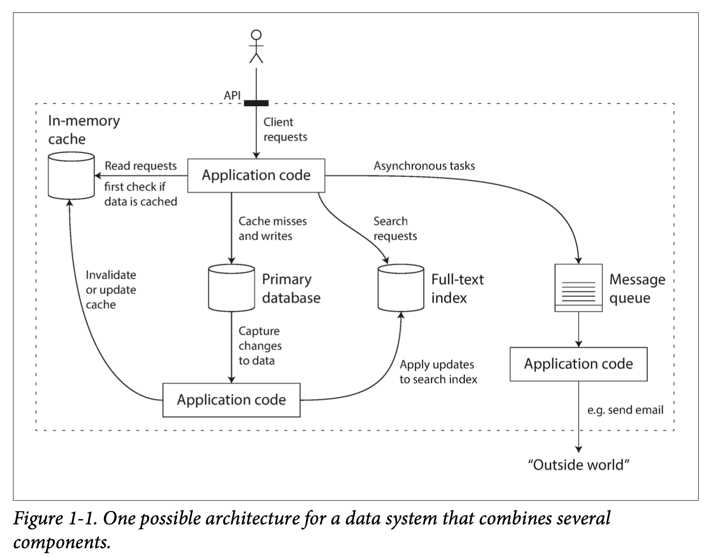
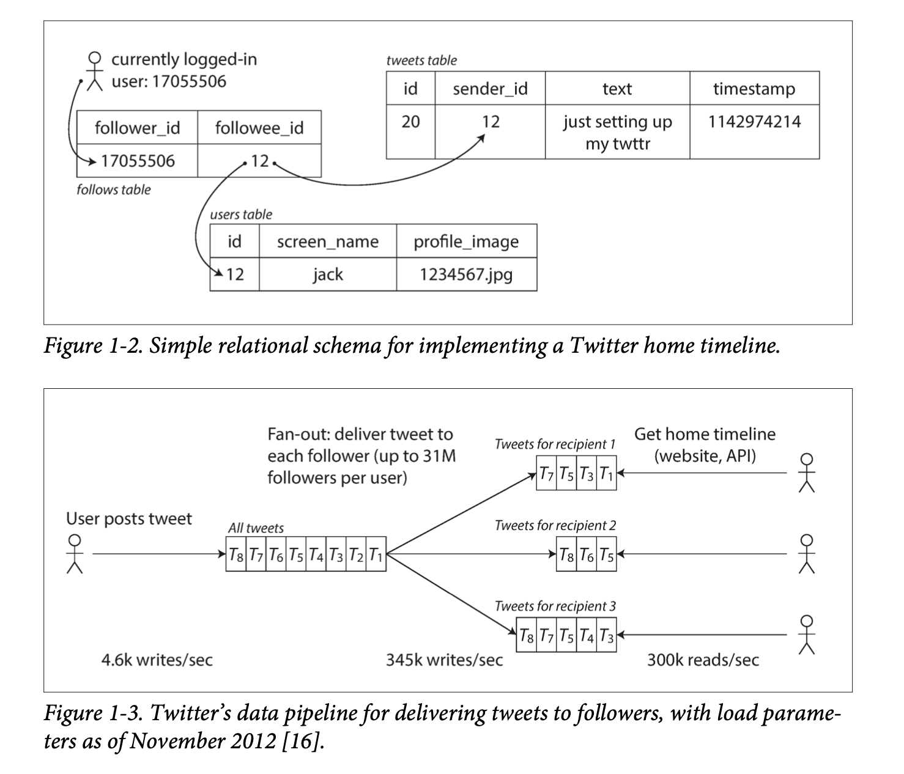

# Designing Data Intensive Application

* We call an application data-intensive if data is its primary challenge - the quantity of data, the complexity of data, or the speed at which it is changing - as opposed to compute-intensive, where CPU cycles are the bottleneck.

# Chapter 1: Reliable, Scalable, and Maintainable Applications

* A data-intensive application is typically built from standard building blocks that provide commonly needed functionality. Many applications need to:
  * Store data so that they, or another application, can find it again later (**databases**)
  * Remember the result of an expensive operation, to speed up reads (**caches**)
  * Allow users to search data by keyword or filter it in various ways (**search indexes**)
  * Send a message to another process, to be handled asynchronously (**stream processing**)
  * Periodically crunch a large amount of accumulated data (**batch processing**)

Although a database and a message queue have some superficial similarity - both store data for some time - **they have very different access patterns, which means different characterstics**, and thus very different implementation.

There are datastores that are also used as message queues (Redis), and there are message queues with database-like durability guarantees (Apache Kafka).

If you have an application-managed caching layer (using Memcached or similar), or a full-text search server (such as Elasticsearch or Solr) separate from your main database, it is normally the application code’s responsibility to keep those caches and indexes in sync with the main database.

Stitching smaller systems together results in a larger data system, with different characteristics.

Figure 1-1 One possible architecture for a data system that combines several components.

## Thinking About Data Systems

We focus on three concerns that are important in most software systems:

* **Reliability**: The system should work correctly (performing the correct function at the desired level of performance) even in the face of adversity.
* **Scalability**: As the system grows(in data , traffic volume, or complexity), there should be reasonable ways of dealing with that growth.
* **Maintainability**: People should be able to work on the system productively in the future.

## Reliability
* Continue to work when faults (NOT failure!) occur. We say such a system is fault-tolerant.
* Faults is defined as components of the system deviating from the spec while failure is defined as a system stop working entirely.
* It is impossible to reduce faults to 0; therefore, we should design a system that tolerates faults.
* Introducing random faults (as in Netflix Chaos Monkey) could improve confidence in fault tolerant systems.
* For security issues, we would prefer to prevent faults over tolerating them, as security breaches cannot be cured.

### Hardware Faults
* In the past, people use redundant hardware to keep machine/service running.
* Hard disks are reported as having a mean time to failure (MTTF) of about 10 to 50 years. Thus, on a storage cluster with 10,000 disks, we should expect on average one disk to die per day.
* AWS’s virtual machine platforms are designed to prioritize flexibility and elasticity over single-machine reliability.
* Recently, platforms are designed to prioritize flexibility and elasticity. Systems can tolerate loss of whole machines. No down time scheduled needed for single machine maintenance.

### Software Errors
* Software errors/bugs are more systematic. They impact all machines in the same service.
* Alerts can help check the SLA guarantees.

### Human Errors
* Most outages are human errors. We can
  * Minimize opportunities for errors through designs.
  * Decouple where mistakes are made (sandbox) and where the mistakes causes failures (production).
  * Test thoroughly, including unit, integration, and manual tests.
  * Allow quick and easy recovery to minimize impact.
  * Set up clear monitoring on performance metrics and error rates.

### How Important Is Reliability
* Reliability is important for the business. Any down time could be revenue losses.
* There are situations where we may tradeoff reliability for lower development cost, but we should be very conscious when we are cutting corners.

## Scalability
* Scalability is the term we use to describe a system’s ability to cope with increased load.

### Describing Load
* Described with load parameters, which has different meaning under different architectures. It can be requests per second for services, read write ratio for databases, number of simultaneous users. Sometimes the average case matters, and sometimes the bottleneck is dominated by a few extreme cases.

* Twitter example
  * Twitter has two main operations: post Tweet and home timeline (~100x more requests than post Tweet).
  * Approach 1: If we store Tweets in a simple database, home timeline queries may be slow. Posting a tweet simply inserts the new tweet into a global collection of tweets. When a user requests their home timeline, look up all the people they follow, find all the tweets for each of those users, and merge them.
  * Approach 2: We can push Tweets into the home timeline cache of each follower when a Tweet is published. Maintain a cache for each user’s home timeline — like a mailbox of tweets for each recipient user. When a user posts a tweet, look up all the people who follow that user, and insert the new tweet into each of their home timeline caches.
  * Approach 2 does not work for users with many followers, since the approach would need to update too many home timeline caches.
  * Distribution of followers in this case is a load parameter.
  * We can use approach 1 for users with many followers and approach 2 for the others.
  * Twitter is now implementing a hybrid of both approaches. For most users, tweets continue to be fanned out to home timelines at the time when they are posted. However, for a small number of users with millions of followers (celebrities), they are exempted from the fan out.

### Performance
* Two ways to look at performance.
  * When we increase load parameters and keep resources unchanged. How is the performance affected.
  * When we increase load parameters how much resource do we need to keep performance unchanged.
* Batch processing systems cares about throughput (number of records processed per second).
* Online systems cares about the response time, which is measured in percentiles like p50, p90, p99, p999.
* Random additional latency could be introduced by a context switch to a background process, the loss of a network packet and TCP retransmission, a garbage collection pause, a page fault forcing a read from disk, mechanical vibrations in the server rack, or many other causes.
* Tail latencies (p999) are sometimes important as they are usually requests from users with a lot of data.
* Percentiles are often used in service level objectives (SLOs) and service level agreements (SLAs)
* Queuing delays often account for a large part of high percentiles. Since parallelism is limited in servers. Slow requests may cause head-of-line blocking and make subsequent requests slow.
* The latency from an end user request is the slowest of all the parallel calls. The more backend calls we make, the higher the chance that one of the requests were slow. This is known as tail latency amplification.

### Coping with Load
* **Scaling up (vertical scaling**, with a more powerful machine) and **scaling out (horizontal scaling**, distributing the load across multiple machines, the shared-nothing architecture) are two popular approaches to cope with increasing load. Good architectures usually involves a mixture of both.
* Elastic systems can add computing resources when load increases automatically but it may have more surprises.
* Scaling up stateful data systems can be complex. For this reason, common wisdom is to use a single node until cost or availability requirements are no longer satisfied. Of course this may change in the future.
* The architecture for large scale systems is usually highly specific and built around its assumptions on which operations will be common or rare. There is no one-size-fits-all scalable architecture.

## Maintainability
* Three design principles to minimize pain for maintenance.

### Operability: Easier Life for Operations

* Operations are for keeping a software system running smoothly.
* Good operability means making routine tasks easy. Data systems can
  * Provide visibility into the runtime behavior
  * Provide support for automation and integration with standard tools
  * Avoid dependencies on individual machines
  * Provide good documentation
  * Provide good default behavior
  * Self-healing where appropriate
  * Minimize surprises

### Simplicity: Managing Complexity
* Complexity slows down engineers working on the system and increases the cost of maintenance.
* Possible complexity symptoms: explosion of state space, tight coupling of modules, tangled dependencies, inconsistent naming and terminology, hacks for solving performance problems, special cases for workarounds, etc.
* We can remove accidental complexity, which is complexity not inherent in the business problem. This can be done through abstraction and hiding implementation details.

### Evolvability: Making Changes Easy
* System requirements will change so we need to make making changes easy.
* Test-driven development and refactoring are tools for building software that is easier to change.
* Refactoring large data systems is different from refactoring a small local application (Agile); therefore, we use the term evolvability to refer to ease to make changes in a data system.

* Functional requirements: what the application should do
* Nonfunctional requirements: general properties like security, reliability, compliance, scalability, compatibility and maintainability.

---

# Chapter 2: Data Model and Query Languages

## Overview
* Data models deeply affects how we think about the problem.
* Data models are built by layering one on top of another. The key question is: “how is it represented in terms of the next-lower layer?” Each layer hides the complexity of the layers below by providing a clean model.
* Every data model embodies assumptions on how it is going to be used. The data model has a profound effect on what the software above can or cannot do.
* In this chapter, we will compare the relational model, the document model, and a few graph-based models. We will also look at and compare various query languages.

## Relational Model Versus Document Model
* The goal of the relational model is to hide implementation details behind a clean interface.
* SQL was rooted in relational databases for business data processing in the 1960s and 1970s, and was used for transaction processing and batch processing.
* SQL was proposed in 1970 and is probably the best-known data model, where data is organized into relations (tables), which is an unordered collection of tuples (rows).

### NoSQL
* NoSQL was just a catchy hashtag on Twitter for a meetup. NoSQL is the latest attempt to overthrow the relational model’s dominance.
* Driving forces for NoSQL
  * A need for better scalability (larger datasets, high write throughput)
  * Preference for free and open source software
  * Specialized query operations that are not supported by the relational model
  * The restrictiveness of the relational schemas.
* It’s likely that relational databases will continue to be used along with many nonrelational databases.

### The Object-Relational Mismatch
* The OOP paradigm requires translation between the relational database model.
* Strategies to deal with the mismatch
  * Normalized databases with foreign keys.
  * Use a database that Supports for structured data (PostgreSQL)
  * Encode as JSON or XML and store as text in database. It can’t be queried this way.
  * Store as JSON in a document in document-oriented databases (MongoDB). This has a better locality than the normalized representation.

## Many-to-One and Many-to-Many Relationships
* For enum-type strings, we can store a separate normalized ID to string table, and use the ID in other parts of the database. This will enforce consistency (same spelling, better search), avoid ambiguity, be easier to update, support localization.
* Using ids reduces duplication. This is the key idea behind normalizing databases. Yet this requires a many-to-one relationship, which may not work well with document databases, whose support for joins are weak.

### Are Document Databases Repeating History
* In 1970s, the IBM’s Information Management System also used a hierarchical model, similar to the JSON model. Data was represetned as a tree of records, nested within records, and the network model and relational model was proposed to solve the limitations of the hierarchical model.

#### The network model
Also known as the CODASYL (Conference on DAta Systems Languages) model, the network model allows multiple parents for each record. The lines between records were not foreign keys, but more like pointers (called access path), which a user can follow through.
A query is done by moving a cursor through the database by iterating over lists of records and following access paths.
Although it made the most efficient use of the hardware, the model made querying and updating the database complicated and inflexible.

#### The relational model
The relational model is simply a relation (table) and a collection of tuples (rows).
In a relational database, the query optimizer automatically decides how to efficiently execute the query, where the developer has to decide the access path in the network model.
Query optimizers will only need to be run once, and all applications using the database can benefit from it.

#### Comparison to document databases
For one-to-many relationships, document databases are similar to hierarchical model in that they store nested records within their parent record rather than separate records.
For many-to-one and many-to-many relationships, document databases are similar to relational databases. The related item is referenced by a document reference (in document databases) and a foreign key (in a relational database).

### Relational Versus Document Databases Today
We then compare the data model of relational and document databases.
Document databases: better schema flexibility, better performance due to locality, and closer to data structures in applications.
Relational databases: better support for joins, and many-to-one and many-to-many relationships.
Which data model leads to simpler application code?
Document model may be a good choice if the application has a document-like structure:tree of one-to-many relationships, while relational models may require splitting a document-like structure into multiple tables.
Records in document models are more difficult to directly access when they are deeply nested.
For applications with many-to-many relationships, document models are less appealing due to the poor support for joins.
For highly interconnected data, document model is awkward, and the relational model is acceptable, and graph models are the most natural.
Schema flexibility in the document level
XML support in relational databases usually comes with schema validation while JSON support does not.
Document databases are sometimes called schemaless, yet there is an implicit schema. A more accurate term is schema-on-read, meaning schema is only interpreted when data is read, in contrast with schema-on-write for relational database, where validation occurs during write time.
An analogy to type checking is dynamic type checking (runtime) and static typing checking (compile-time). In general there is no right or wrong answer.
To change a schema in document databases, applications would start writing new documents with the new schema, while in relational databases, one would need a migration query (which is quick for most databases, except MySQL).
Schema-on-read is advantageous if items in the collection don’t all have the same structure.
Schema-on-write is advantageous when all records are expected to have the same structure.
Data locality for queries
If the whole document (string of JSON, XML) is required by application often, there is a performance advantage to this storage locality (single lookup, no joins required). If only a small portion of the data is required, this can be wasteful.
It’s generally recommended to keep documents small and avoid writes that increases the size of documents (same size updates can be done in-place).
Google’s Spanner database allows table rows to be nested in a parent table. Oracle’s database allows multi-table index cluster tables. The column-family concept (used in Cassandra and HBase) has a similar purpose for managing locality.
Convergence of document and relational databases
Most relational databases (except MySQL) supports XML. PostgreSQL, MySQL, DB2 supports JSON.
RethinkDQ supports joins, and some MongoDB drivers resolves database references.
A hybrid of relational and document models is probably the future.
Query Language for Data
SQL is a declarative query language, while IMS (IBM’s Information Management System) and CODASYL are queried by imperative code.
In a declarative language, only the goal is specified, not how the goal is achieved. It hides implementation details and leaves room for performance optimization.
The fact that SQL is more limited in functionality gives databases more room for automatic optimizations.
Declarative code is easier to parallelize as execution order is not specified.
Declarative Queries on the Web
CSS and XSL are declarative languages to specify styling in HTML, while changing styles directly through Javascript is imperative.
Specifying styles using CSS is much better than changing styles directly using Javascript.
MapReduce Querying
MapReduce is a programming model for processing large amounts of data in bulk across many machines, and a limited form of MapReduce is supported by MongoDB and CouchDB.
MapReduce is somewhere between declarative and imperative.
SQL can, but not necessarily have to, be implemented by MapReduce operations.
MongoDB supports a declarative query language called aggregation pipeline, where users don’t need to coordinate a map and reduce function themselves.
Graph-Like Data Models
An application with mostly one-to-many relationships or no relationships between records, the document model is appropriate, but for many-to-many relationships, graph models are more appropriate.
Graphs can be homogeneous, where all vertices represent the same type of object and heterogeneous, where vertices may represent completely different objects.
Property Graphs
In the property graph model, each vertex consists of
A unique identifier
A set of outgoing edges
A set of incoming edges
A collection of properties (key-value pairs)
Each edge consists of
A unique identifier
The vertex at which the edge starts (the tail vertex)
The vertex at which the edge ends (the head vertex)
A collection of properties (key-value pairs)
The property graph model is analogous to storing two relational databases, one for vertices, one for edges.
Multiple relationships can be stored within the same graph by proper labeling the edges.
Graphs can be easily extended to accommodate new data types.
The Cypher Query Language
Cypher is a declarative query language for property graphs, created for the Neo4j graph database.
Graph Queries in SQL
Usually, we know which joins to run in relational database queries, yet in a graph query, the number of joins is not fixed in advance, as we may need to follow an edge multiple times.
Triple-Stores and SPARQL
In a triple-store, all information is stored in a three-part statement: subject, predicate, object.
The subject is equivalent to a vertex in a graph.
The object can be:
A value in a primitive datatype. In this case, the predicate and object forms the key and value of a property of the subject vertex.
Another vertex in the graph. In this case, the predicate is the edge between the subject vertex and the object vertex.
The semantic web
The triple-store data model is completely independent of the semantic web.
The main idea of semantic web is to have webpages publish data in a consistent format: Resource Description Framework (RDF). Unfortunately, the semantic web hasn’t been realized in practice much.
The RDF data model
RDF can be written in Turtle/N3 or XML.
Namespaces are important in RDFs to distinguish the same word across different domains.
The SPARQL query language
SPARQL is a query language for triple-stores using the RDF data model.
Comparing Graph Databases and the Network Model
 	CODASYL	Graph Databases
Nested records	Specifies which record type can be nested within which other record type	No limitations
Access	Requires traversals to reach a particular record	Can use unique ID or index vertices in advance
Children of record	Has to be ordered	No limitations
Query language	Imperative code	Declarative languages
The Foundation: Datalog
Datalog is a much older language than SPARQL or Cypher.
It writes relationship (similar to the triple-store model) as predicate(subject, object).
One can compose new rules from simple rules (it can be recursive!).
Words start with upper and lower cases are variables and predicates, respectively.
New rules that has all simple rules matched are also added to the database.
Summary
 	Pros	Cons
Hierarchical	Straightforward for one-to-many relationships	Not good for many-to-many or many-to-one relationships, imperative code for querying.
Network	Straightforward for many-to-many relationships	Imperative code for querying
Relational (SQL)	Generalize well	Throughput scalability, restrictiveness of relational schema (harder to extend), object-relational mismatch.
Document (NoSQL)	Throughput scalability, good for self contained documents, easier to extend.	Not good for data with many cross-document relationships.
Graph (NoSQL)	Good for many-to-many relationships, easier to extend..	Harder to do sum and max queries. Link
Document, relational, and graph are all widely used. Although we can emulate one in another, it could be awkward.
Next chapter will discuss tradeoff during implementing those data models.

Reference:
* https://aweather.github.io 
