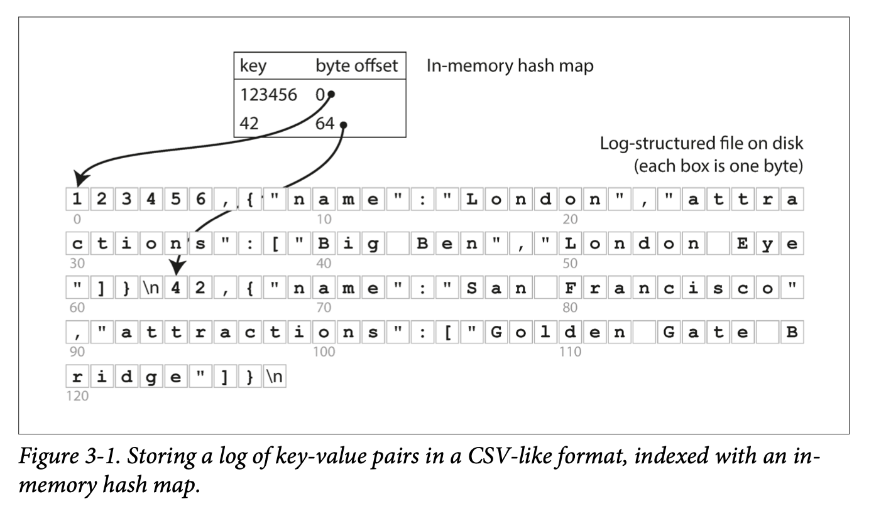
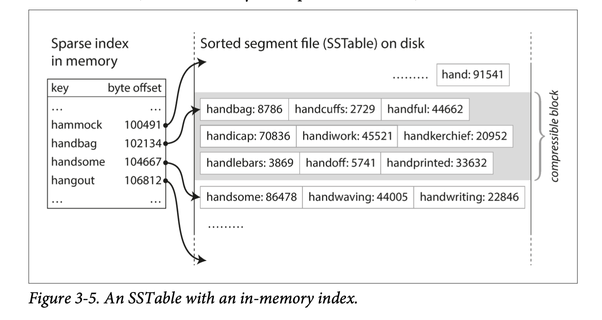
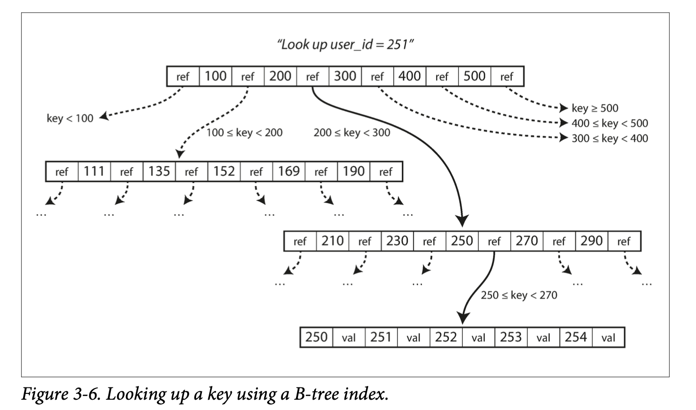
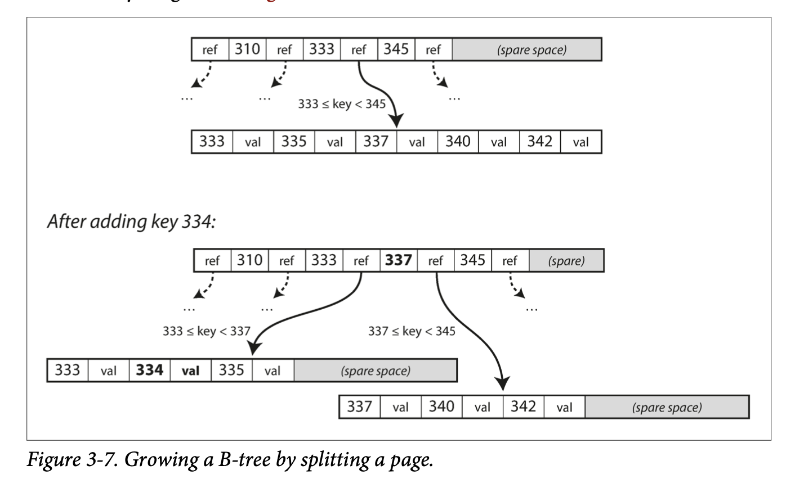
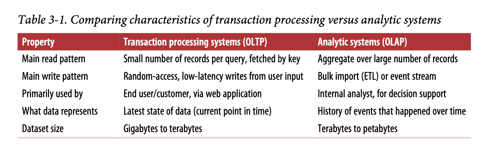
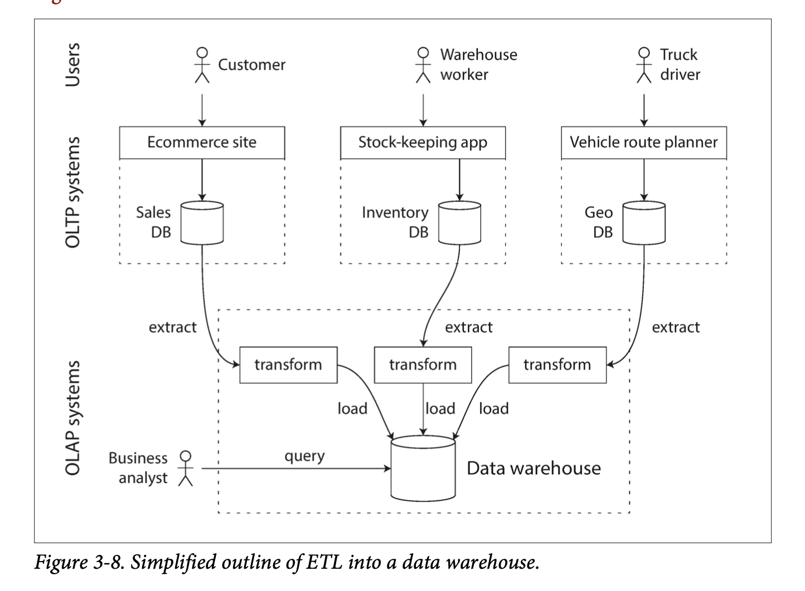

# Designing Data Intensive Application

# Table of Contents
1. [Chapter 1: Reliable, Scalable, and Maintainable Applications](#chapter1)
2. [Chapter 2: Data Model and Query Languages](#chapter2)
3. [Chapter 3: Storage and retrieval](#chapter3)
4. [Chapter 4: Encoding and Evolution](#chapter4)

* We call an application data-intensive if data is its primary challenge - the quantity of data, the complexity of data, or the speed at which it is changing - as opposed to compute-intensive, where CPU cycles are the bottleneck.

---

# Chapter 1: Reliable, Scalable, and Maintainable Applications 

* A data-intensive application is typically built from standard building blocks that provide commonly needed functionality. Many applications need to:
  * Store data so that they, or another application, can find it again later (**databases**)
  * Remember the result of an expensive operation, to speed up reads (**caches**)
  * Allow users to search data by keyword or filter it in various ways (**search indexes**)
  * Send a message to another process, to be handled asynchronously (**stream processing**)
  * Periodically crunch a large amount of accumulated data (**batch processing**)

Although a database and a message queue have some superficial similarity - both store data for some time - **they have very different access patterns, which means different characterstics**, and thus very different implementation.

There are datastores that are also used as message queues (Redis), and there are message queues with database-like durability guarantees (Apache Kafka).

If you have an application-managed caching layer (using Memcached or similar), or a full-text search server (such as Elasticsearch or Solr) separate from your main database, it is normally the application code’s responsibility to keep those caches and indexes in sync with the main database.

Stitching smaller systems together results in a larger data system, with different characteristics.

Figure 1-1 One possible architecture for a data system that combines several components.

## Thinking About Data Systems

We focus on three concerns that are important in most software systems:

* **Reliability**: The system should work correctly (performing the correct function at the desired level of performance) even in the face of adversity.
* **Scalability**: As the system grows(in data , traffic volume, or complexity), there should be reasonable ways of dealing with that growth.
* **Maintainability**: People should be able to work on the system productively in the future.

## Reliability
* Continue to work when faults (NOT failure!) occur. We say such a system is fault-tolerant.
* Faults is defined as components of the system deviating from the spec while failure is defined as a system stop working entirely.
* It is impossible to reduce faults to 0; therefore, we should design a system that tolerates faults.
* Introducing random faults (as in Netflix Chaos Monkey) could improve confidence in fault tolerant systems.
* For security issues, we would prefer to prevent faults over tolerating them, as security breaches cannot be cured.

### Hardware Faults
* In the past, people use redundant hardware to keep machine/service running.
* Hard disks are reported as having a mean time to failure (MTTF) of about 10 to 50 years. Thus, on a storage cluster with 10,000 disks, we should expect on average one disk to die per day.
* AWS’s virtual machine platforms are designed to prioritize flexibility and elasticity over single-machine reliability.
* Recently, platforms are designed to prioritize flexibility and elasticity. Systems can tolerate loss of whole machines. No down time scheduled needed for single machine maintenance.

### Software Errors
* Software errors/bugs are more systematic. They impact all machines in the same service.
* Alerts can help check the SLA guarantees.

### Human Errors
* Most outages are human errors. We can
  * Minimize opportunities for errors through designs.
  * Decouple where mistakes are made (sandbox) and where the mistakes causes failures (production).
  * Test thoroughly, including unit, integration, and manual tests.
  * Allow quick and easy recovery to minimize impact.
  * Set up clear monitoring on performance metrics and error rates.

### How Important Is Reliability
* Reliability is important for the business. Any down time could be revenue losses.
* There are situations where we may tradeoff reliability for lower development cost, but we should be very conscious when we are cutting corners.

## Scalability
* Scalability is the term we use to describe a system’s ability to cope with increased load.

### Describing Load
* Described with load parameters, which has different meaning under different architectures. It can be requests per second for services, read write ratio for databases, number of simultaneous users. Sometimes the average case matters, and sometimes the bottleneck is dominated by a few extreme cases.

* Twitter example
  * Twitter has two main operations: post Tweet and home timeline (~100x more requests than post Tweet).
  * Approach 1: If we store Tweets in a simple database, home timeline queries may be slow. Posting a tweet simply inserts the new tweet into a global collection of tweets. When a user requests their home timeline, look up all the people they follow, find all the tweets for each of those users, and merge them.
  * Approach 2: We can push Tweets into the home timeline cache of each follower when a Tweet is published. Maintain a cache for each user’s home timeline — like a mailbox of tweets for each recipient user. When a user posts a tweet, look up all the people who follow that user, and insert the new tweet into each of their home timeline caches.
  * Approach 2 does not work for users with many followers, since the approach would need to update too many home timeline caches.
  * Distribution of followers in this case is a load parameter.
  * We can use approach 1 for users with many followers and approach 2 for the others.
  * Twitter is now implementing a hybrid of both approaches. For most users, tweets continue to be fanned out to home timelines at the time when they are posted. However, for a small number of users with millions of followers (celebrities), they are exempted from the fan out.

### Performance
* Two ways to look at performance.
  * When we increase load parameters and keep resources unchanged. How is the performance affected.
  * When we increase load parameters how much resource do we need to keep performance unchanged.
* Batch processing systems cares about throughput (number of records processed per second).
* Online systems cares about the response time, which is measured in percentiles like p50, p90, p99, p999.
* Random additional latency could be introduced by a context switch to a background process, the loss of a network packet and TCP retransmission, a garbage collection pause, a page fault forcing a read from disk, mechanical vibrations in the server rack, or many other causes.
* Tail latencies (p999) are sometimes important as they are usually requests from users with a lot of data.
* Percentiles are often used in service level objectives (SLOs) and service level agreements (SLAs)
* Queuing delays often account for a large part of high percentiles. Since parallelism is limited in servers. Slow requests may cause head-of-line blocking and make subsequent requests slow.
* The latency from an end user request is the slowest of all the parallel calls. The more backend calls we make, the higher the chance that one of the requests were slow. This is known as tail latency amplification.

### Coping with Load
* **Scaling up (vertical scaling**, with a more powerful machine) and **scaling out (horizontal scaling**, distributing the load across multiple machines, the shared-nothing architecture) are two popular approaches to cope with increasing load. Good architectures usually involves a mixture of both.
* Elastic systems can add computing resources when load increases automatically but it may have more surprises.
* Scaling up stateful data systems can be complex. For this reason, common wisdom is to use a single node until cost or availability requirements are no longer satisfied. Of course this may change in the future.
* The architecture for large scale systems is usually highly specific and built around its assumptions on which operations will be common or rare. There is no one-size-fits-all scalable architecture.

## Maintainability
* Three design principles to minimize pain for maintenance.

### Operability: Easier Life for Operations

* Operations are for keeping a software system running smoothly.
* Good operability means making routine tasks easy. Data systems can
  * Provide visibility into the runtime behavior
  * Provide support for automation and integration with standard tools
  * Avoid dependencies on individual machines
  * Provide good documentation
  * Provide good default behavior
  * Self-healing where appropriate
  * Minimize surprises

### Simplicity: Managing Complexity
* Complexity slows down engineers working on the system and increases the cost of maintenance.
* Possible complexity symptoms: explosion of state space, tight coupling of modules, tangled dependencies, inconsistent naming and terminology, hacks for solving performance problems, special cases for workarounds, etc.
* We can remove accidental complexity, which is complexity not inherent in the business problem. This can be done through abstraction and hiding implementation details.

### Evolvability: Making Changes Easy
* System requirements will change so we need to make making changes easy.
* Test-driven development and refactoring are tools for building software that is easier to change.
* Refactoring large data systems is different from refactoring a small local application (Agile); therefore, we use the term evolvability to refer to ease to make changes in a data system.

* Functional requirements: what the application should do
* Nonfunctional requirements: general properties like security, reliability, compliance, scalability, compatibility and maintainability.

---

# Chapter 2: Data Model and Query Languages 

## Overview
* Data models are important part of developing software, it deeply affects how we think about the problem.
* Data models are built by layering one on top of another. The key question is: “how is it represented in terms of the next-lower layer?” Each layer hides the complexity of the layers below by providing a clean model.
* The data model has a profound effect on what the software above can or cannot do.
* In this chapter, we will compare the relational model, the document model, and a few graph-based models. We will also look at and compare various query languages.

## Relational Model Versus Document Model
* The goal of the relational model is to hide implementation details behind a clean interface.
* SQL was rooted in relational databases for business data processing in the 1960s and 1970s, and was used for transaction processing and batch processing.
* SQL was proposed in 1970 and is probably the best-known data model, where data is organized into relations (tables), which is an unordered collection of tuples (rows).

### The Birth of NoSQL
* NoSQL was just a catchy hashtag on Twitter for a meetup. NoSQL is the latest attempt to overthrow the relational model’s dominance.
* Driving forces for NoSQL
  * A need for better scalability (larger datasets, high write throughput)
  * Preference for free and open source software
  * Specialized query operations that are not supported by the relational model
  * The restrictiveness of the relational schemas
* It’s likely that relational databases will continue to be used along with many nonrelational databases.

### The Object-Relational Mismatch
* With a SQL model, if data is stored in a relational tables, an awkward translation layer is translated, this is called impedance mismatch.
* Strategies to deal with the mismatch
  * Normalized databases with foreign keys.
  * Use a database that Supports for structured data (PostgreSQL)
  * Encode as JSON or XML and store as text in database. It can’t be queried this way.
  * Store as JSON in a document in document-oriented databases (MongoDB). This has a better locality than the normalized representation.
* JSON representation has better locality than the multi-table SQL schema. All the relevant information is in one place, and one query is sufficient.

## Many-to-One and Many-to-Many Relationships
* For enum-type strings, we can store a separate normalized ID to string table, and use the ID in other parts of the database. This will enforce consistency (same spelling, better search), avoid ambiguity, be easier to update, support localization.
* Using ids reduces duplication. This is the key idea behind normalizing databases. Yet this requires a many-to-one relationship, which may not work well with document databases, whose support for joins are weak.

### Relational Versus Document Databases Today
* We then compare the data model of relational and document databases.
  * Document databases: better schema flexibility, better performance due to locality, and closer to data structures in applications.
  * Relational databases: better support for joins, and many-to-one and many-to-many relationships.

#### Which data model leads to simpler application code?
* Document model may be a good choice if the application has a document-like structure:tree of one-to-many relationships, while relational models may require splitting a document-like structure into multiple tables.
* Records in document models are more difficult to directly access when they are deeply nested.
* For applications with many-to-many relationships, document models are less appealing due to the poor support for joins.
* For highly interconnected data, document model is awkward, and the relational model is acceptable, and graph models are the most natural.

#### Schema flexibility in the document level
* XML support in relational databases usually comes with schema validation while JSON support does not.
* Document databases are sometimes called schemaless, yet there is an implicit schema. A more accurate term is **schema-on-read**, meaning schema is only interpreted when data is read, in contrast with **schema-on-write** for relational database, where validation occurs during write time.
* An analogy to type checking is dynamic type checking (runtime) and static typing checking (compile-time). In general there is no right or wrong answer.
* To change a schema in document databases, applications would start writing new documents with the new schema, while in relational databases, one would need a migration query (which is quick for most databases, except MySQL).
* Schema-on-read is advantageous if items in the collection don’t all have the same structure.
* Schema-on-write is advantageous when all records are expected to have the same structure.

#### Data locality for queries
* If the whole document (string of JSON, XML) is required by application often, there is a performance advantage to this storage locality (single lookup, no joins required). If only a small portion of the data is required, this can be wasteful.
* It’s generally recommended to keep documents small and avoid writes that increases the size of documents (same size updates can be done in-place).
* Google’s Spanner database allows table rows to be nested in a parent table. Oracle’s database allows multi-table index cluster tables. The column-family concept (used in Cassandra and HBase) has a similar purpose for managing locality.

#### Convergence of document and relational databases
* Most relational databases (except MySQL) supports XML. PostgreSQL, MySQL, DB2 supports JSON.
* RethinkDQ supports joins, and some MongoDB drivers resolves database references.
* A hybrid of relational and document models is probably the future.

## Query Language for Data
* SQL is a declarative query language.
* In a declarative language, only the goal is specified, not how the goal is achieved. It hides implementation details and leaves room for performance optimization.
* The fact that SQL is more limited in functionality gives databases more room for automatic optimizations.
* Declarative code is easier to parallelize as execution order is not specified.

### Declarative Queries on the Web
* CSS and XML are declarative languages to specify styling in HTML, while changing styles directly through Javascript is imperative.
* Specifying styles using CSS is much better than changing styles directly using Javascript.

### MapReduce Querying
* MapReduce is a programming model for processing large amounts of data in bulk across many machines, and a limited form of MapReduce is supported by MongoDB and CouchDB.
* MapReduce is somewhere between declarative and imperative.
* SQL can, but not necessarily have to, be implemented by MapReduce operations.
* MongoDB supports a declarative query language called aggregation pipeline, where users don’t need to coordinate a map and reduce function themselves.

## Graph-Like Data Models
* An application with mostly one-to-many relationships or no relationships between records, the document model is appropriate, but for many-to-many relationships, graph models are more appropriate.
* Graphs can be homogeneous, where all vertices represent the same type of object and heterogeneous, where vertices may represent completely different objects.

### Property Graphs
* In the property graph model, each vertex consists of
  * A unique identifier
  * A set of outgoing edges
  * A set of incoming edges
  * A collection of properties (key-value pairs)
* Each edge consists of
  * A unique identifier
  * The vertex at which the edge starts (the tail vertex)
  * The vertex at which the edge ends (the head vertex)
  * A collection of properties (key-value pairs)
* The property graph model is analogous to storing two relational databases, one for vertices, one for edges.
* Multiple relationships can be stored within the same graph by proper labeling the edges.
* Graphs can be easily extended to accommodate new data types.

### The Cypher Query Language
* Cypher is a declarative query language for property graphs, created for the Neo4j graph database.

### Graph Queries in SQL
* Usually, we know which joins to run in relational database queries, yet in a graph query, the number of joins is not fixed in advance, as we may need to follow an edge multiple times.

### Triple-Stores and SPARQL
* In a triple-store, all information is stored in a three-part statement: subject, predicate, object.
* The subject is equivalent to a vertex in a graph.
* The object can be:
  * A value in a primitive datatype. In this case, the predicate and object forms the key and value of a property of the subject vertex.
  * Another vertex in the graph. In this case, the predicate is the edge between the subject vertex and the object vertex.

---

# Chapter 3: Storage and Retrieval 

## Overview
* Databases fundamentally does two things: Store data and retrieve the stored data.
* Chapter 3 discusses how data model and queries are interpreted by databases.
* Understanding under-the-hood details can help us pick the right solution and tune the performance.
* We’ll first look at two types of storage engines: log-structured and page-oriented storage engines.

## Data Structures That Power Your Database
* Many databases internally uses a log, which is a append-only data file.
* To retrieve data efficiently, we need an index, which is an additional structure derived from primary data and only affects performance of queries.
* Well-chosen indexes speed up queries but slow down writes. Therefore, databases don’t index everything by default and requires developers to use knowledge of query pattens to choose index manually.

## Hash Indexes
* Hash Indexes are for key-value data and are similar to a dictionary, which is usually implemented as a hash map (hash table).
* If the database writes only append new entires to a file, the hash table can simply store key to byte offset in the data file. The hash table (with keys) has to fit into memory for quick look up performance, but the values don’t have to fit into memory.

* To avoid the disk run out of space, a good solution is to break logs into segments and perform compaction (remove duplicate keys). Further, file segments can be merged while performing compaction. We can use a background thread to perform merging and compaction and switch our read request to the newly created segment when they are read. Afterwards, old segments can be deleted.
* Bitcask (the default storage engine in Riak) does it like that. The only requirement it has is that all the keys fit in the available RAM. Values can use more space than there is available in memory, since they can be loaded from disk.

* A storage engine like Bitcask is well suited to situations where the value for each key is updated frequently. There are a lot of writes, but there are too many distinct keys, you have a large number of writes per key, but it's feasible to keep all keys in memory.
* There are a few details for a real implementation of the idea above
  * Use bytes instead of CSV
  * Deletes are adding a special log entry to the data file (tombstone) and the data will be removed during merging and compaction.
  * Index will need to be snapshotted for fast crash recovery (compared to re-indexing).
  * Checksums are required for detecting partially written records.
  * Writes has to strictly be in sequential order. Many implementation choose to have one writer thread.
* Why append-only logs are good
  * Sequential writes are much faster than random writes, especially on magnetic spinning-disk hard drives and to some extent SSDs.
  * Concurrency and crash recovery are much simpler if segment files are append-only or immutable.
  * Merging old segments avoids data fragmentation.
* What are the limitations of hash table indexes?
  * Hash table must fit into memory. If there are too many keys, it will not fit.
  * Range queries are not efficient.

## SSTables and LSM-Trees
* The **Sorted String Table (SSTable)** requires each segment file to be sorted by key. It has the following advantages.
  * Merging segments is simple and efficient.
  * We no longer require offset of every single key for efficient lookup. One key for every few kilobytes of segment file is usually sufficient.
  * Since reading requires a linear scan in between indexed keys, we can group those records and compress them to save storage or I/O bandwidth.

### Constructing and maintaining SSTables
* While maintaining a sorted structure on disk is possible (B-Trees), red-black trees or AVL trees can be used to keep logs sorted in memory. The flow is as follows:
  * When a write comes in, insert the entry to the in-memory data structure (sometimes called **memtable**).
  * When memtable gets bigger than some threshold (a few megabytes), create a new memtable to handle new writes, and write the old memtable to disk.
  * For reads, first try to find the key in memtable, and in the latest segment, and in the second last segment.
  * Occasionally, run a merging and compaction process to combine segment files.
* The issue with this scheme is that in-memory data will be lost if the database crashes. We can keep a separate unsorted log for recovery and this log can be discarded whenever a memtable is dumped to disk.
* This indexing structure is named **Log-Structure Merge-Tree (LSM-Tree)**.

### Making an LSM-tree out of SSTables
* The algorithm here is used by LevelDB and RocksDB, which are key-value storage libraries to be used in other applications. Similar storage systems are also used in Cassandra and HBase.
* Systems that uses the principle of merging and compacting sorted files are often called LSM systems.

### Performance optimizations
* A look up can take a long time if the entry does not exist in any of the memtable. Bloom filters can be used to solve this issue.
* There are two major strategies to determine the order and timing of merging and compaction: size-tiered (HBase, Cassandra) and level compaction (LevelDB, RockDB, Cassandra).
  * Size-tiered: newer and smaller SSTables are merged into larger ones.
  * Level: The key range is split up into several SSTables and older data is moved to separate “levels,” which allows compaction to proceed more incrementally and use less disk space.
* LSM-tree: Write throughput is high. Can efficiently index data much larger than memory.

## B-Trees
* While log-structured indexes are gaining acceptance, B-tree is the most widely used indexing structure.
* B-trees is the standard index implementation for almost all relational databases and most non-relational databases.
* B-trees also keep key-value entires sorted by key, which allows quick value lookups and range queries.
* Log-structure indexes breaks databases down into variable length segments (several mbs or more), while B-tree breaks databases down into a fixed-size blocks or pages (4KB traditionally, but depends on underlying hardware).
* Each page can be identified by an address or location, which can be stored in another page on disk.

* A root page contains the full range of keys (or reference to pages containing the full range) and is where query start.
* A leaf page contains only individual keys, which contains the value inline or reference to where the values can be found.
* The branching factor is the number of references to a child page in one page of a B-tree.
* When changing values in B-trees, the page containing the value is looked up, modified, and written back to disk.
* When adding new values, first, the page whose range contains the key is looked up. If there is extra space in the page, the key-value entry is simply added, else, the page is split into two halves and the parent page is updated to account for the new file structure.

* The algorithm above ensures a B-tree with n nodes is always balanced and has a depth of O(logn).

### Making B-Trees reliable
* When changing values or splitting pages, the B-tree overwrites data on disk. This is a risky operation. If anything crashes during an overwrite, the index could be corrupted.
* To make B-tree more resilient to such failures, a common solution is to include an write-ahead-log (WAL, or redo log), which every B-tree modification is first written to. In case of failure, this log can be used to restore the B-tree back to a consistent state.
* Care should also be taken when multiple threads may access the B-tree at the same time. An inconsistent state could be read during an update. Latches (lightweight locks) can be placed to protect the tree’s integrity.

### B-tree optimizations
* Just to mention a few optimizations:
  * Copy-on-write and atomic to remove the need to maintain a WAL for crashes
  * Key compression by storing essential information for acting as boundaries.
  * Arrange page on disk such that pages appear in sequential order on disk.
  * Additional pointers (such as left, right siblings) to allow efficient scanning of keys in order without jumping back to parents.
  * Fractal trees to reduce disk seeks.

## Comparing B-Trees and LSM-Trees
* Typically, B-Trees are faster for reads and LSM-Trees are faster for writes. The actual performance for a specific system would require benchmarking.

### Advantages of LSM-trees
* Both B-Tree and LSM-tree indexes would require writing a piece of data to disk multiple times on write. This effect is known as **write amplification**. In write heavy applications, write amplification would directly impact performance.
* LSM-trees are typically able to sustain higher write throughput due to two main reasons: a lower write amplification and a sequential write (especially on magnetic hard drives).
* LSM-trees can be compressed better and have lower fragmentation due to rewriting of SSTables.
* Even on SSDs, LSM-trees are still advantages as it represents data more compactly and allows more read and write requests within the same bandwidth.

### Downsides of LSM-trees
* The compaction process of LSM-trees can sometimes interfere with reads and writes, as reads and writes can be blocked by the compaction process on disk resources. Although the impact on average response time is usually small, this could greatly increase high-percentage response time.
* If write throughput is high and compaction is not configured correctly, it is not impossible that compaction can’t keep up with incoming writes. Unmerged segments will then grow until disk space is all used. This effect has to be actively monitored.
* Since each key only appears once in a B-tree, B-trees are more attractive in databases when transaction isolation is implemented using locks on range of keys.

## Other Indexing Structures
* Secondary indexes can be created from a key-value index. The main difference between primary and secondary indexes is that secondary indexes are not unique. This can be solved two ways:
  * Make the value in the index a list of matching row identifiers.
  * Make each key unique by adding a row identifier to the secondary key.
* Both B-trees and log-structured indexes can be used as secondary indexes.

### Storing values within the index
* In a key-value pair, the key is used to locate the entry and the value can be either the actual data or a reference to the storage location (known as a heap file). Using heap files is common for building multiple secondary indexes to reduce duplication.
* When updating values without changing keys, if the new value is no larger than old data, the value can be directly overwritten, and if the new value is larger, either all indexes needs to be updated or a forwarding pointer can be left in the old record.
* Sometimes, the extra hop to the heap file is too expensive for reads, and the indexed row is stored directly in the index. This is called a **clustered index.**
* A compromise between a non-clustered index and a clustered index is a **covering index** or index with included columns, where only some columns are stored within the index.

### Multi-column indexes
* Multi-column indexes are created for querying rows using multiple columns of a table.
* The concatenate index is the most common multi-column index. This is done by simply concatenating fields together into one key. However the index is useless when a query is based on only one column.
* To index a two-dimensional location database (with latitude and longitude), we can use a space-filling curve and use a regular B-tree index. Specialized spatial index such as R-trees are also used.

### Full-text search and fuzzy indexes
* Some applications require searching for a similar key. This can be done by fuzzy indexes.
* For example, Lucene allows searching for words within edit distance 1. In Lucene, the in-memory index is a finite state automaton over the characters in the keys (similar to a trie). This automaton can then be transformed into a Levenshtein automaton, which supports efficient search for words within a given distance.

### Keeping everything in memory
* Some in-memory key-value stores, such as Memcached, are intended for caching only, where data is lost when the machine restarts. Some other in-memory databases aim for durability, which can be achieved with special hardware and saving change logs and snapshots to disk.
* Counterintuitively, in-memory databases are faster mainly because they avoid serialization and deserialization between in-memory structures and binaries, not because of the disk read and write time.
* In-memory databases could also provide data models that are hard to implement with disk-based indexes, such as priority queues, stacks.
* The anti-caching approach, where the least-recently-used data is dumped to disk when there is not enough memory and loaded back when queried, enables in-memory databases to support larger-than-memory databases. Yet the index would still have to fit into memory.

## Transaction Processing or Analytics?
* The term transaction (an entry) was coined in the early days of databases, where commercial transactions were the main entries in databases. Although the data in databases are now different, the access pattern: looking up a few entries by key, inserting or updating data based on user input, remains the same and is referred to as online transaction processing (OLTP).
* Databases nowadays are also used for data analytics. The access pattern: scanning through the whole database and performing aggregation, is a very different from OLTP. This pattern is referred to as the online analytic processing (OLAP).

* Starting 1980s, people stopped using OLTP systems for OLAP applications. The data for analytics is hosted in a separate database - a data warehouse.

### Data Warehousing
* OLTP is expected to be highly available with low latency, so it is not ideal to run analytics on OLTP databases.
* A data warehouse contains a read-only copy of the data in OLTP systems through periodic dumps or stream of updates.
* The process of getting data from OLTP systems to data warehouses is called Extract-Transform-Load (ETL).

* Data warehouses, separate from OLTP systems, can be optimized for analytics access patterns.
* The indexing algorithms mentioned above are for OLTP systems, not analytics.

#### The divergence between OLTP databases and data warehouses
* Although most data warehouses use a relational data model, the internals of the systems is very different as they are optimized for different access patterns.
* Although some products combines OLTP with data warehousing (Microsoft SQL, SAP HANA), they are increasingly becoming two separate systems.

### Stars and Snowflakes: Schemas for Analytics
* Many data warehousing systems uses a star-schema, whose center is a fact table, where each row represents an event. The fact table uses foreign keys to refer to other tables (called dimension tables) for entities (with extra information) that was involved in the event.
* The snowflake schema further breaks dimensions down into sub-dimensions. Snowflake schemas are more normalized than star schemas, but star schemas are easier for analysts to work with.
* A typical data warehouse, tables could be very wide (up to several hundred columns), and dimension tables could also be very wide.

## Column-Oriented Storage
* A typical data warehouse query only access several rows.
* In most OLTP and document databases, storage is laid out in a row-oriented fashion, meaning all data from one row are stored next to each other. This is inefficient for queries which only accesses a few columns of all rows. The whole row will have to be read and filtered down to the columns of interest.
* In column-oriented storage, data of all rows from each column are stored together. It relies on each file containing the rows in the same order.

### Column Compression
* Column-oriented storage often lends itself to good compression.
* Bitmap encoding of distinct values in a column can lead to good compression. Further, if the bitmap is sparse, we can use run-length encoding for more compression.
* Bitmap indexes are good for “equal” and “contain” queries.

### Sort Order in Column Storage
* Although storing column in insertion order is easy, we can choose to sort them based on what queries are common.
* The administrator can specify a column for the database to be sorted in as well as a second column to break ties.
* The sorted columns would be much easier to compress if there are not a lot of distinct values in the column.

#### Several different sort orders
* Since data warehouse usually store multiple copies of the same data, it could use a different sort order for each replication, so that we can use different datasets for different queries.
* An analogy of multiple sorted orders to row-based databases is multiple secondary indexes. The difference is that row-based databases stores the data in one place and use pointers in secondary indexes, while column stores don’t use any pointers.

### Writing to Column-Oriented Storage
* Sorted columns optimizes for read-only queries, yet writes are more difficult.
* In-place updates would require rewriting the whole column on every write. Instead, we can use a LSM-tree like structure where a in-memory store buffers the new writes. When enough new writes are accumulated, they are then merged with the column files and written to new files in bulk.
* Queries, in this case, would require reading data from both disk and the in-memory store. This will be hidden within the engine and invisible to the user.

### Aggregation: Data Cubes and Materialized Views
* Since many queries involves aggregation functions, a data warehouse can cache materialized aggregates to avoid recomputing expensive queries.
* One way of creating such a cache is a materialized view, which is defined like a standard view, but with results stored on disk, while virtual views are expanded and processed at query time.
* Updating materialized view, when data changes, is expensive, and therefore materialized views are not used in OLTP systems often.
* A common special case of materialized view is a data cube or OLAP cube, where data is pre-summarized over each dimension. This enables fast queries with precomputed queries, yet a data cube may not have the flexibility as raw data.

---
# Chapter 4: Encoding and Evolution 

## Overview
* Evolvability is important for maintainability in the long term, as applications inevitably change over time.
* Relational databases ensures all data conforms to the same format. The schema can be changed, but there is always only one schema.
* Schema-on-read databases can contain data a mix of data with older and newer formats.
* For larger applications, schema updates often cannot happen at the same time:
  * Server side application can perform rolling-upgrade: a few nodes are updated at a time. No service downtime required.
  * Client side application depends entirely on the user.
* This means old and new versions of the code and data may exist at the same time.
* We define **backward compatibility** as: newer code can read data written by older code. This is usually easier.
* We define **forward compatibility** as: older code can read data written by newer code. This could be tricker.

## Formats for Encoding Data
* Data usually are in one the following two representation:
  * In memory, data is kept in objects, structs, list, arrays, hash tables, trees, etc. Those data structures are optimized for efficient access and manipulation.
  * When data is written to a file or sent over the network, data are encoded into a sequence of bytes.
* Translating from in-memory representation to a byte sequence is called encoding, **serialization**, or **marshalling**. The revers is called decoding, parsing, deserialization, unmarshalling. This book uses the terms encoding and decoding.

### Language-Specific Formats
* Java has Serializable, Ruby has Marshal, python has pikle and so on. Although language-specific formats comes with built-in support and are convenient, they have a few issues. 
  * Encoding is tied to a specific programming language, and cross-language reads are difficult. Migration to another language could be very expensive.
  * Decoding needs to be able to instantiating arbitrary classes, which could be a security problem.
  * Versioning is often an afterthought, and forward and backward compatibility is generally overlooked.
  * Efficiency is often an afterthought. Java's serialization is notorious for bad performance and bloated encoding.
* TLDR. Don’t use them.

### JSON, XML, and Binary Formats
* JSON, XML, CSV are textual formats and somewhat human readable, yet they have the following problems:
  * There is a lot of ambiguity around encoding of numbers. In XML and CSV, a numeric string and a number are the same. JSON doesn’t distinguish integers and floating-point numbers. Also, integers greater than  2^53  cannot be exactly represented by a IEEE 754 double-precision floating-point number.
  * JSON and XML support Unicode character strings well but they don’t support binary strings.
  * While there is schema support for XML and JSON, many JSON-based tools don’t use schemas. Applications that don’t use schemas need to hardcode the encoding and decoding logic.
  * CSV does not have a schema, so encoding and decoding logic will have to be hardcoded. Also, not all CSV parsers handles escaping rules correctly.
* Despite the flaws, XML, JSON, and CSV are good enough for many purposes as long as application developers agree on the format.

#### Binary Encoding
* For bigdata, the efficiency of encoding can have a larger impact.
* Binary formats for JSON and XML have been developed but only adopted in niches.
* Those binary representation usually keep the data model unchanged and keeps field names within the encoded data.
* The book gave a MessagePack example where the data was compressed from 81 bytes to 61 bytes.

### Thrift and Protocol Buffers
* Thrift and Protocol Buffers (protobuf) require a schema for encoding and decoding. They have their own schema definition language, which can then be use to generate code for multiple languages.
* Since Thrift and Protocol Buffers encodes the schema in code, the encoding does not need the field names but only field tags (positive integers).
* Thrift has two binary encoding formats: BinaryProtocol and CompactProtocol. CompactProtocol packs field type and tag number into a single byte and uses variable length encoding for integers.
* Thrift and Protocol Buffers allow a field to be optional, yet the actual binary encoding does not have this information. The difference is only at run-time, where read a missing required field would result in an exception.

#### Field tags and schema evolution
* Each field in Thrift and Protocol Buffers has a tag number and a data type. Since each field is identified only by the field tag, the name can be changed and the field tag number cannot be changed.
* For forward compatiblility, old code can simply skip the fields with unknown tags. For backward compatibility, as long as the newly added field is optional, new code can read data without the new optional field without throwing exceptions.

#### Datatypes and schema evolution
* Changing datatypes is trickier. Changing a 64-bit integer to 32-bit integer would lose precision or get truncated.
* Protocol Buffers does not have a list or array datatype, but has a repeated marker for fields that can appear multiple times. It is okay to change an optional field into a repeated field. New code sees a list of zero or one elements; old code reading new data sees the last element in the list. Thrift does not have this flexibility.

### Arvo
* Arvo has two schema languages, one Arvo IDL for human editing and one JSON based that is more machine-readable.
* There are no tag numbers in the schema. The encoding is a concatenation of field values.

#### The writer’s schema and the reader’s schema
* Arvo supports schema evolvability by keeping track of the writer’s schema and compare it with the reader’s schema.
* The reader’s and writer’s schema don’t have to be the same but only have to be compatible.

#### Schema evolution rules
* To maintain compatibility, one can only add or remove a field with a default value.
* Note that Arvo does not allow nulls to be a default value unless a union type, which includes a null, is the type of the field. As a result, Arvo does not have optional and required.
* Changing the datatype is possible as long as Arvo can convert the type. Changing the name of the field is done by adding aliases of field names, so a new reader’s schema can match old writer’s schema. Note this is only backward compatible, not forward compatible.

#### But what is the writer’s schema?
* Since it is inefficient to encode the writer’s schema with each data entry, how the writer’s schema is handled depends on the context.
  * Storing many entries of the same schema: the writer’s schema can be written once at the beginning of the file.
  * Database with individually written records: one can include a version number for each record and store a map of schema version to schema in a separate database.
  * Sending data over a network: The schema can be negotiated during the connection setup time if the communication is bidirectional.
* A database of schema versions is a useful thing that can also be used as a documentation of the evolution history.

#### Dynamically generated schemas
* Since Arvo does not use tags for fields, it is friendlier to dynamic generated schemas. No code generation is required when the schema changes. For example, if we have an application that dumps relational database contents to disk, we do not need to perform code generation a new schema every time the database adds a new field.

#### Code generation and dynamically typed languages
* Code generation is more aligned with statically typed languages as it allows efficient in-memory structures to be used for decoded data, and it allows type checking and autocompletion in IDEs. However, for dynamically typed languages code generation becomes a burden, as they usually avoid an explicit compilation step.
* Arvo provides optional code generation for statically typed languages, but it can be used without any code generation as long as you have the writer’s schema. This is especially useful for working with dynamically typed data processing languages.

### The Merits of Schemas
* Compared to JSON, XML, and CSV, formats with a schema, such as Protocol Buffer, Thrift, and Arvo have the following good properties:
  * They are simpler to implement.
  * They are much more compact.
  * The schema is a form of documentation.
  * Keeping a database of schemas allows one to check forward and backward compatibility before anything is deployed.
  * Automatic code generation for statically typed languages.

## Modes of Dataflow
The most common ways of how data flows between applications are:
through database,
through service calls,
and through asynchronous message passing.
Dataflow Through Databases
Data can be sent from one application to a different application or the application’s future self through databases.
A process that writes to a database encodes the data, and a process that reads data from a database decodes the data.
Both backward and forward compatibility are required here.
An old process reading and writing a record of new data will need to preserve the unknown fields.
Different values written at different times
Databases may persist data for years, and it is common that data outlives code.
Rewriting (migrating) data to a new schema while possible is expensive. Some relational database allows filling nulls as values for new columns.
Schema evolution allows the entire database to appear as if it was encoded with a single schema, even if the binary format was encoded with different versions of the schema.
Archival storage
When taking a snapshot or dumping data into a data warehouse, one can encode all data in the latest schema.
Dataflow Through Services: REST and RPC
Data can be sent from a one application (client) to another application (server) through network over the API (service) the server exposes.
HTTP is the transport protocol and is independent of the server-client agreement of the API.
A few examples of clients:
Web browsers retrieves data using HTTP GET requests and submits data through HTTP POST requests.
A native application could also make requests to a server and a client-side JavaScript application can use XMLHttpRequest to become an HTTP client (Ajax). In this case the response is usually not human readable but for further processing by the client.
A server can be a client of another service. Breaking down a monolithic service into smaller services is referred to as the microservices architecture or service-oriented architecture.
The goal for microservices architecture is to make each subservice independently deployable and evolvable. Therefore, we will need both forward and backward compatibility for the binary encodings of data.
Web services
When HTTP is used as the protocol for talking to the service, it is called a web service, for example:
A client application making requests to a service over HTTP over public internet.
A service making requests to services within the same organization. Software that supports such services is sometimes called middleware.)
A service making requests to services owned by a different organization.
There are two approaches for designing the API for web services REST and SOAP.
REST uses simple data formats, URLs for identifying resources, and HTTP features for cache control, authentication and content type negotiation. APIs designed based on REST principles are called RESTful.
SOAP is a XML-based protocol. While it uses HTTP, it avoids using HTTP features. SOAP APIs are described using Web Services Description Language (WSDL), which enables code generation. WSDL is complicated and requires tool support for constructing requests manually.
REST has been gaining popularity.
The problems with remote procedure calls (RPCs)
The RPC model treats a request to a remote network service the same as a calling a function within the same process (this is called location transparency.) This approach has the following issues:
A network request is more unpredictable than a local function call.
A local function call returns a result, throws an exception, or never returns, but a network call may return without a result, due to a timeout.
Retrying a failed network request is not the right solution, as the request could have gone through, but the response was lost.
The run time for the function is unpredictable.
Passing references to objects in local memory requires encoding the whole object and could be expensive for large objects.
The client and server may be implemented in different languages, so the framework must handle the datatype translations.
Current directions for RPC
The new generation of RPC frameworks is more explicit about the fact that a remote call is different from a local call, e.g., Finagle and Rest.li use futures (promises) to encapsulate asynchronous actions that may fail. Some of those frameworks provide service discovery to allow clients to find out which IP address and port number it can find a particular service.
Custom RPC protocols with binary encoding can achieve better performance than JSON over REST, but RESTful APIs are easier to test and is supported by all mainstream programming languages.
Data encoding and evolution for RPC
We can assume the server will always be updated before the clients, so we only need backward compatibility on requests and forward compatibility on responses.
The compatibilities of a RPC scheme are directly inherited by the binary encoding scheme it uses.
RESTful APIs usually uses JSON for responses or URI-encoded/form-encoded for requests. Therefore, adding optional new request parameters or response fields maintains compatible.
For public APIs, the provider has no control over its clients and will have to maintain them for a long time.
There is no agreement on how API versioning should work. For RESTful APIs, common approaches are to use a version number in the URL or in the HTTP Accept header.
Message-Passing Dataflow
Asynchronous message-passing systems are somewhere between RPC and databases. Data is sent from a process to another process with low latency through a message broker, which stores the message temporarily.
Using a message broker, compare to direct RPC, the advantages are:
It can act as a buffer to improve reliability.
It can redeliver messages to a process that has crashed.
The sender does not need to know the IP or port of the recipient.
It allows one message to be sent to multiple receivers.
It decouples the sender and receiver.
The communication is one-way and asynchronous. The sender doesn’t wait for the response from the receiver.
Message brokers
Message brokers are used as follows. The producer sends a message to a named queue or topic, and the broker ensures the message is delivered to the consumers or subscribers of that queue or topic. There could be many producers and consumers on the same topic.
Ideally the messages should be encoded by a forward and backward compatible scheme. If a consumer republishes a message to another topic, it may need to preserve unknown fields.
Distributed actor frameworks
The actor model is a programming model for concurrency in a single process. Each actor may have its own state and communicates with other actors through sending and receiving asynchronous messages.
In distributed actor frameworks, the actor model is used to scale an application across multiple nodes. The same message-passing mechanism is used.
Location transparency works better in the actor model than RPC, since the model already assumes the messages could be lost.
Three popular distributed actor frameworks: Akka, Orleans, Erlang OPT.

Summarised from DDIS:https://github.com/Yang-Yanxiang/Designing-Data-Intensive-Applications 
Other Ref: https://aweather.github.io/software-engineering
