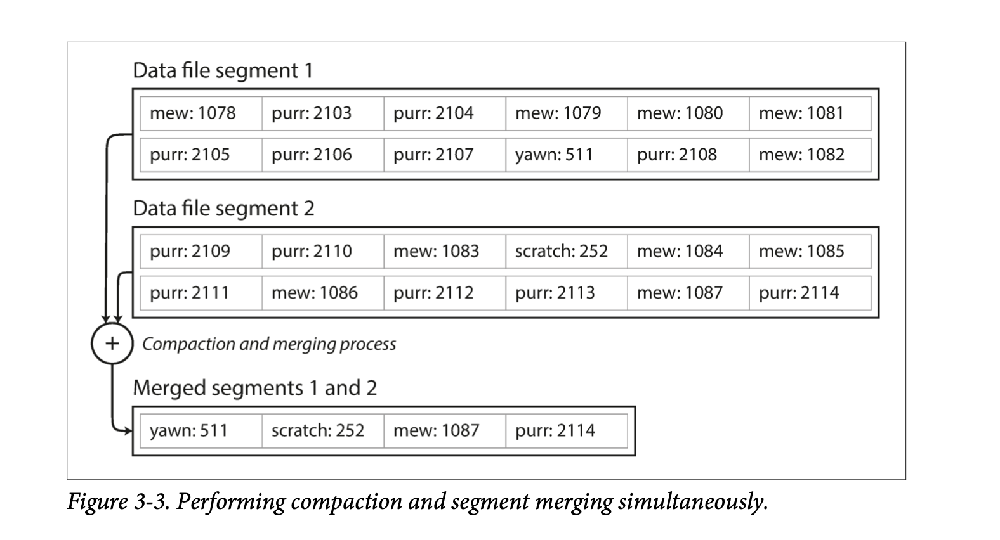
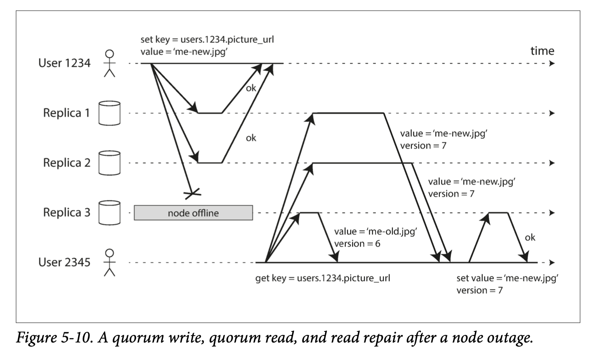

# Designing Data Intensive Application

# Table of Contents
1. [Chapter 1: Reliable, Scalable, and Maintainable Applications](#chapter1)
2. [Chapter 2: Data Model and Query Languages](#chapter2)
3. [Chapter 3: Storage and retrieval](#chapter3)
4. [Chapter 4: Encoding and Evolution](#chapter4)
5. [Chapter 5: Replication](#chapter5)
6. [Chapter 6: Partitioning](#chapter6)
7. [Chapter 7: Transactions](#chapter7)
8. 

We call an application data-intensive if data is its primary challenge - the quantity of data, the complexity of data, or the speed at which it is changing - as opposed to compute-intensive, where CPU cycles are the bottleneck.

---

# Chapter 1: Reliable, Scalable, and Maintainable Applications 

* A data-intensive application is typically built from standard building blocks that provide commonly needed functionality. Many applications need to:
  * Store data so that they, or another application, can find it again later (**databases**)
  * Remember the result of an expensive operation, to speed up reads (**caches**)
  * Allow users to search data by keyword or filter it in various ways (**search indexes**)
  * Send a message to another process, to be handled asynchronously (**stream processing**)
  * Periodically crunch a large amount of accumulated data (**batch processing**)

Although a database and a message queue have some superficial similarity - both store data for some time - **they have very different access patterns, which means different characterstics**, and thus very different implementation.

There are datastores that are also used as message queues (Redis), and there are message queues with database-like durability guarantees (Apache Kafka).

If you have an application-managed caching layer (using Memcached or similar), or a full-text search server (such as Elasticsearch or Solr) separate from your main database, it is normally the application code’s responsibility to keep those caches and indexes in sync with the main database.

Stitching smaller systems together results in a larger data system, with different characteristics.

Figure 1-1 One possible architecture for a data system that combines several components.

## Thinking About Data Systems

We focus on three concerns that are important in most software systems:

* **Reliability**: The system should work correctly (performing the correct function at the desired level of performance) even in the face of adversity.
* **Scalability**: As the system grows(in data , traffic volume, or complexity), there should be reasonable ways of dealing with that growth.
* **Maintainability**: People should be able to work on the system productively in the future.

## Reliability
* Continue to work when faults (NOT failure!) occur. We say such a system is fault-tolerant.
* Faults is defined as components of the system deviating from the spec while failure is defined as a system stop working entirely.
* It is impossible to reduce faults to 0; therefore, we should design a system that tolerates faults.
* Introducing random faults (as in Netflix Chaos Monkey) could improve confidence in fault tolerant systems.
* For security issues, we would prefer to prevent faults over tolerating them, as security breaches cannot be cured.

### Hardware Faults
* In the past, people use redundant hardware to keep machine/service running.
* Hard disks are reported as having a mean time to failure (MTTF) of about 10 to 50 years. Thus, on a storage cluster with 10,000 disks, we should expect on average one disk to die per day.
* AWS’s virtual machine platforms are designed to prioritize flexibility and elasticity over single-machine reliability.
* Recently, platforms are designed to prioritize flexibility and elasticity. Systems can tolerate loss of whole machines. No down time scheduled needed for single machine maintenance.

### Software Errors
* Software errors/bugs are more systematic. They impact all machines in the same service.
* Alerts can help check the SLA guarantees.

### Human Errors
* Most outages are human errors. We can
  * Minimize opportunities for errors through designs.
  * Decouple where mistakes are made (sandbox) and where the mistakes causes failures (production).
  * Test thoroughly, including unit, integration, and manual tests.
  * Allow quick and easy recovery to minimize impact.
  * Set up clear monitoring on performance metrics and error rates.

### How Important Is Reliability
* Reliability is important for the business. Any down time could be revenue losses.
* There are situations where we may tradeoff reliability for lower development cost, but we should be very conscious when we are cutting corners.

## Scalability
* Scalability is the term we use to describe a system’s ability to cope with increased load.

### Describing Load
* Described with load parameters, which has different meaning under different architectures. It can be requests per second for services, read write ratio for databases, number of simultaneous users. Sometimes the average case matters, and sometimes the bottleneck is dominated by a few extreme cases.

* Twitter example
  * Twitter has two main operations: post Tweet and home timeline (~100x more requests than post Tweet).
  * Approach 1: If we store Tweets in a simple database, home timeline queries may be slow. Posting a tweet simply inserts the new tweet into a global collection of tweets. When a user requests their home timeline, look up all the people they follow, find all the tweets for each of those users, and merge them.
  * Approach 2: We can push Tweets into the home timeline cache of each follower when a Tweet is published. Maintain a cache for each user’s home timeline — like a mailbox of tweets for each recipient user. When a user posts a tweet, look up all the people who follow that user, and insert the new tweet into each of their home timeline caches.
  * Approach 2 does not work for users with many followers, since the approach would need to update too many home timeline caches.
  * Distribution of followers in this case is a load parameter.
  * We can use approach 1 for users with many followers and approach 2 for the others.
  * Twitter is now implementing a hybrid of both approaches. For most users, tweets continue to be fanned out to home timelines at the time when they are posted. However, for a small number of users with millions of followers (celebrities), they are exempted from the fan out.

### Performance
* Two ways to look at performance.
  * When we increase load parameters and keep resources unchanged. How is the performance affected.
  * When we increase load parameters how much resource do we need to keep performance unchanged.
* Batch processing systems cares about throughput (number of records processed per second).
* Online systems cares about the response time, which is measured in percentiles like p50, p90, p99, p999.
* Random additional latency could be introduced by a context switch to a background process, the loss of a network packet and TCP retransmission, a garbage collection pause, a page fault forcing a read from disk, mechanical vibrations in the server rack, or many other causes.
* Tail latencies (p999) are sometimes important as they are usually requests from users with a lot of data.
* Percentiles are often used in service level objectives (SLOs) and service level agreements (SLAs)
* Queuing delays often account for a large part of high percentiles. Since parallelism is limited in servers. Slow requests may cause head-of-line blocking and make subsequent requests slow.
* The latency from an end user request is the slowest of all the parallel calls. The more backend calls we make, the higher the chance that one of the requests were slow. This is known as tail latency amplification.

### Coping with Load
* **Scaling up (vertical scaling**, with a more powerful machine) and **scaling out (horizontal scaling**, distributing the load across multiple machines, the shared-nothing architecture) are two popular approaches to cope with increasing load. Good architectures usually involves a mixture of both.
* Elastic systems can add computing resources when load increases automatically but it may have more surprises.
* Scaling up stateful data systems can be complex. For this reason, common wisdom is to use a single node until cost or availability requirements are no longer satisfied. Of course this may change in the future.
* The architecture for large scale systems is usually highly specific and built around its assumptions on which operations will be common or rare. There is no one-size-fits-all scalable architecture.

## Maintainability
* Three design principles to minimize pain for maintenance.

### Operability: Easier Life for Operations

* Operations are for keeping a software system running smoothly.
* Good operability means making routine tasks easy. Data systems can
  * Provide visibility into the runtime behavior
  * Provide support for automation and integration with standard tools
  * Avoid dependencies on individual machines
  * Provide good documentation
  * Provide good default behavior
  * Self-healing where appropriate
  * Minimize surprises

### Simplicity: Managing Complexity
* Complexity slows down engineers working on the system and increases the cost of maintenance.
* Possible complexity symptoms: explosion of state space, tight coupling of modules, tangled dependencies, inconsistent naming and terminology, hacks for solving performance problems, special cases for workarounds, etc.
* We can remove accidental complexity, which is complexity not inherent in the business problem. This can be done through abstraction and hiding implementation details.

### Evolvability: Making Changes Easy
* System requirements will change so we need to make making changes easy.
* Test-driven development and refactoring are tools for building software that is easier to change.
* Refactoring large data systems is different from refactoring a small local application (Agile); therefore, we use the term evolvability to refer to ease to make changes in a data system.

* Functional requirements: what the application should do
* Nonfunctional requirements: general properties like security, reliability, compliance, scalability, compatibility and maintainability.

---

# Chapter 2: Data Model and Query Languages 

## Overview
* Data models are important part of developing software, it deeply affects how we think about the problem.
* Data models are built by layering one on top of another. The key question is: “how is it represented in terms of the next-lower layer?” Each layer hides the complexity of the layers below by providing a clean model.
* The data model has a profound effect on what the software above can or cannot do.
* In this chapter, we will compare the relational model, the document model, and a few graph-based models. We will also look at and compare various query languages.

## Relational Model Versus Document Model
* The goal of the relational model is to hide implementation details behind a clean interface.
* SQL was rooted in relational databases for business data processing in the 1960s and 1970s, and was used for transaction processing and batch processing.
* SQL was proposed in 1970 and is probably the best-known data model, where data is organized into relations (tables), which is an unordered collection of tuples (rows).

### The Birth of NoSQL
* NoSQL was just a catchy hashtag on Twitter for a meetup. NoSQL is the latest attempt to overthrow the relational model’s dominance.
* Driving forces for NoSQL
  * A need for better scalability (larger datasets, high write throughput)
  * Preference for free and open source software
  * Specialized query operations that are not supported by the relational model
  * The restrictiveness of the relational schemas
* It’s likely that relational databases will continue to be used along with many nonrelational databases.

### The Object-Relational Mismatch
* With a SQL model, if data is stored in a relational tables, an awkward translation layer is translated, this is called impedance mismatch.
* Strategies to deal with the mismatch
  * Normalized databases with foreign keys.
  * Use a database that Supports for structured data (PostgreSQL)
  * Encode as JSON or XML and store as text in database. It can’t be queried this way.
  * Store as JSON in a document in document-oriented databases (MongoDB). This has a better locality than the normalized representation.
* JSON representation has better locality than the multi-table SQL schema. All the relevant information is in one place, and one query is sufficient.

## Many-to-One and Many-to-Many Relationships
* For enum-type strings, we can store a separate normalized ID to string table, and use the ID in other parts of the database. This will enforce consistency (same spelling, better search), avoid ambiguity, be easier to update, support localization.
* Using ids reduces duplication. This is the key idea behind normalizing databases. Yet this requires a many-to-one relationship, which may not work well with document databases, whose support for joins are weak.

### Relational Versus Document Databases Today
* We then compare the data model of relational and document databases.
  * Document databases: better schema flexibility, better performance due to locality, and closer to data structures in applications.
  * Relational databases: better support for joins, and many-to-one and many-to-many relationships.

#### Which data model leads to simpler application code?
* Document model may be a good choice if the application has a document-like structure:tree of one-to-many relationships, while relational models may require splitting a document-like structure into multiple tables.
* Records in document models are more difficult to directly access when they are deeply nested.
* For applications with many-to-many relationships, document models are less appealing due to the poor support for joins.
* For highly interconnected data, document model is awkward, and the relational model is acceptable, and graph models are the most natural.

#### Schema flexibility in the document level
* XML support in relational databases usually comes with schema validation while JSON support does not.
* Document databases are sometimes called schemaless, yet there is an implicit schema. A more accurate term is **schema-on-read**, meaning schema is only interpreted when data is read, in contrast with **schema-on-write** for relational database, where validation occurs during write time.
* An analogy to type checking is dynamic type checking (runtime) and static typing checking (compile-time). In general there is no right or wrong answer.
* To change a schema in document databases, applications would start writing new documents with the new schema, while in relational databases, one would need a migration query (which is quick for most databases, except MySQL).
* Schema-on-read is advantageous if items in the collection don’t all have the same structure.
* Schema-on-write is advantageous when all records are expected to have the same structure.

#### Data locality for queries
* If the whole document (string of JSON, XML) is required by application often, there is a performance advantage to this storage locality (single lookup, no joins required). If only a small portion of the data is required, this can be wasteful.
* It’s generally recommended to keep documents small and avoid writes that increases the size of documents (same size updates can be done in-place).
* Google’s Spanner database allows table rows to be nested in a parent table. Oracle’s database allows multi-table index cluster tables. The column-family concept (used in Cassandra and HBase) has a similar purpose for managing locality.

#### Convergence of document and relational databases
* Most relational databases (except MySQL) supports XML. PostgreSQL, MySQL, DB2 supports JSON.
* RethinkDQ supports joins, and some MongoDB drivers resolves database references.
* A hybrid of relational and document models is probably the future.

## Query Language for Data
* SQL is a declarative query language.
* In a declarative language, only the goal is specified, not how the goal is achieved. It hides implementation details and leaves room for performance optimization.
* The fact that SQL is more limited in functionality gives databases more room for automatic optimizations.
* Declarative code is easier to parallelize as execution order is not specified.

### Declarative Queries on the Web
* CSS and XML are declarative languages to specify styling in HTML, while changing styles directly through Javascript is imperative.
* Specifying styles using CSS is much better than changing styles directly using Javascript.

### MapReduce Querying
* MapReduce is a programming model for processing large amounts of data in bulk across many machines, and a limited form of MapReduce is supported by MongoDB and CouchDB.
* MapReduce is somewhere between declarative and imperative.
* SQL can, but not necessarily have to, be implemented by MapReduce operations.
* MongoDB supports a declarative query language called aggregation pipeline, where users don’t need to coordinate a map and reduce function themselves.

## Graph-Like Data Models
* An application with mostly one-to-many relationships or no relationships between records, the document model is appropriate, but for many-to-many relationships, graph models are more appropriate.
* Graphs can be homogeneous, where all vertices represent the same type of object and heterogeneous, where vertices may represent completely different objects.

### Property Graphs
* In the property graph model, each vertex consists of
  * A unique identifier
  * A set of outgoing edges
  * A set of incoming edges
  * A collection of properties (key-value pairs)
* Each edge consists of
  * A unique identifier
  * The vertex at which the edge starts (the tail vertex)
  * The vertex at which the edge ends (the head vertex)
  * A collection of properties (key-value pairs)
* The property graph model is analogous to storing two relational databases, one for vertices, one for edges.
* Multiple relationships can be stored within the same graph by proper labeling the edges.
* Graphs can be easily extended to accommodate new data types.

### The Cypher Query Language
* Cypher is a declarative query language for property graphs, created for the Neo4j graph database.

### Graph Queries in SQL
* Usually, we know which joins to run in relational database queries, yet in a graph query, the number of joins is not fixed in advance, as we may need to follow an edge multiple times.

### Triple-Stores and SPARQL
* In a triple-store, all information is stored in a three-part statement: subject, predicate, object.
* The subject is equivalent to a vertex in a graph.
* The object can be:
  * A value in a primitive datatype. In this case, the predicate and object forms the key and value of a property of the subject vertex.
  * Another vertex in the graph. In this case, the predicate is the edge between the subject vertex and the object vertex.

---

# Chapter 3: Storage and Retrieval 

## Overview
* Databases fundamentally does two things: Store data and retrieve the stored data.
* Chapter 3 discusses how data model and queries are interpreted by databases.
* Understanding under-the-hood details can help us pick the right solution and tune the performance.
* We’ll first look at two types of storage engines: log-structured and page-oriented storage engines.

## Data Structures That Power Your Database
* Many databases internally uses a log, which is a append-only data file.
* To retrieve data efficiently, we need an index, which is an additional structure derived from primary data and only affects performance of queries.
* Well-chosen indexes speed up queries but slow down writes. Therefore, databases don’t index everything by default and requires developers to use knowledge of query pattens to choose index manually.

## Hash Indexes
* Hash Indexes are for key-value data and are similar to a dictionary, which is usually implemented as a hash map (hash table).
* If the database writes only append new entires to a file, the hash table can simply store key to byte offset in the data file. The hash table (with keys) has to fit into memory for quick look up performance, but the values don’t have to fit into memory.

* To avoid the disk run out of space, a good solution is to break logs into segments and perform compaction (remove duplicate keys). Further, file segments can be merged while performing compaction. We can use a background thread to perform merging and compaction and switch our read request to the newly created segment when they are read. Afterwards, old segments can be deleted.
* Bitcask (the default storage engine in Riak) does it like that. The only requirement it has is that all the keys fit in the available RAM. Values can use more space than there is available in memory, since they can be loaded from disk.

* A storage engine like Bitcask is well suited to situations where the value for each key is updated frequently. There are a lot of writes, but there are too many distinct keys, you have a large number of writes per key, but it's feasible to keep all keys in memory.
* There are a few details for a real implementation of the idea above
  * Use bytes instead of CSV
  * Deletes are adding a special log entry to the data file (tombstone) and the data will be removed during merging and compaction.
  * Index will need to be snapshotted for fast crash recovery (compared to re-indexing).
  * Checksums are required for detecting partially written records.
  * Writes has to strictly be in sequential order. Many implementation choose to have one writer thread.
* Why append-only logs are good
  * Sequential writes are much faster than random writes, especially on magnetic spinning-disk hard drives and to some extent SSDs.
  * Concurrency and crash recovery are much simpler if segment files are append-only or immutable.
  * Merging old segments avoids data fragmentation.
* What are the limitations of hash table indexes?
  * Hash table must fit into memory. If there are too many keys, it will not fit.
  * Range queries are not efficient.

## SSTables and LSM-Trees
* The **Sorted String Table (SSTable)** requires each segment file to be sorted by key. It has the following advantages.
  * Merging segments is simple and efficient.
  * We no longer require offset of every single key for efficient lookup. One key for every few kilobytes of segment file is usually sufficient.
  * Since reading requires a linear scan in between indexed keys, we can group those records and compress them to save storage or I/O bandwidth.

### Constructing and maintaining SSTables
* While maintaining a sorted structure on disk is possible (B-Trees), red-black trees or AVL trees can be used to keep logs sorted in memory. The flow is as follows:
  * When a write comes in, insert the entry to the in-memory data structure (sometimes called **memtable**).
  * When memtable gets bigger than some threshold (a few megabytes), create a new memtable to handle new writes, and write the old memtable to disk.
  * For reads, first try to find the key in memtable, and in the latest segment, and in the second last segment.
  * Occasionally, run a merging and compaction process to combine segment files.
* The issue with this scheme is that in-memory data will be lost if the database crashes. We can keep a separate unsorted log for recovery and this log can be discarded whenever a memtable is dumped to disk.
* This indexing structure is named **Log-Structure Merge-Tree (LSM-Tree)**.

### Making an LSM-tree out of SSTables
* The algorithm here is used by LevelDB and RocksDB, which are key-value storage libraries to be used in other applications. Similar storage systems are also used in Cassandra and HBase.
* Systems that uses the principle of merging and compacting sorted files are often called LSM systems.

### Performance optimizations
* A look up can take a long time if the entry does not exist in any of the memtable. Bloom filters can be used to solve this issue.
* There are two major strategies to determine the order and timing of merging and compaction: size-tiered (HBase, Cassandra) and level compaction (LevelDB, RockDB, Cassandra).
  * Size-tiered: newer and smaller SSTables are merged into larger ones.
  * Level: The key range is split up into several SSTables and older data is moved to separate “levels,” which allows compaction to proceed more incrementally and use less disk space.
* LSM-tree: Write throughput is high. Can efficiently index data much larger than memory.

## B-Trees
* While log-structured indexes are gaining acceptance, B-tree is the most widely used indexing structure.
* B-trees is the standard index implementation for almost all relational databases and most non-relational databases.
* B-trees also keep key-value entires sorted by key, which allows quick value lookups and range queries.
* Log-structure indexes breaks databases down into variable length segments (several mbs or more), while B-tree breaks databases down into a fixed-size blocks or pages (4KB traditionally, but depends on underlying hardware).
* Each page can be identified by an address or location, which can be stored in another page on disk.

* A root page contains the full range of keys (or reference to pages containing the full range) and is where query start.
* A leaf page contains only individual keys, which contains the value inline or reference to where the values can be found.
* The branching factor is the number of references to a child page in one page of a B-tree.
* When changing values in B-trees, the page containing the value is looked up, modified, and written back to disk.
* When adding new values, first, the page whose range contains the key is looked up. If there is extra space in the page, the key-value entry is simply added, else, the page is split into two halves and the parent page is updated to account for the new file structure.

* The algorithm above ensures a B-tree with n nodes is always balanced and has a depth of O(logn).

### Making B-Trees reliable
* When changing values or splitting pages, the B-tree overwrites data on disk. This is a risky operation. If anything crashes during an overwrite, the index could be corrupted.
* To make B-tree more resilient to such failures, a common solution is to include an write-ahead-log (WAL, or redo log), which every B-tree modification is first written to. In case of failure, this log can be used to restore the B-tree back to a consistent state.
* Care should also be taken when multiple threads may access the B-tree at the same time. An inconsistent state could be read during an update. Latches (lightweight locks) can be placed to protect the tree’s integrity.

### B-tree optimizations
* Just to mention a few optimizations:
  * Copy-on-write and atomic to remove the need to maintain a WAL for crashes
  * Key compression by storing essential information for acting as boundaries.
  * Arrange page on disk such that pages appear in sequential order on disk.
  * Additional pointers (such as left, right siblings) to allow efficient scanning of keys in order without jumping back to parents.
  * Fractal trees to reduce disk seeks.

## Comparing B-Trees and LSM-Trees
* Typically, B-Trees are faster for reads and LSM-Trees are faster for writes. The actual performance for a specific system would require benchmarking.

### Advantages of LSM-trees
* Both B-Tree and LSM-tree indexes would require writing a piece of data to disk multiple times on write. This effect is known as **write amplification**. In write heavy applications, write amplification would directly impact performance.
* LSM-trees are typically able to sustain higher write throughput due to two main reasons: a lower write amplification and a sequential write (especially on magnetic hard drives).
* LSM-trees can be compressed better and have lower fragmentation due to rewriting of SSTables.
* Even on SSDs, LSM-trees are still advantages as it represents data more compactly and allows more read and write requests within the same bandwidth.

### Downsides of LSM-trees
* The compaction process of LSM-trees can sometimes interfere with reads and writes, as reads and writes can be blocked by the compaction process on disk resources. Although the impact on average response time is usually small, this could greatly increase high-percentage response time.
* If write throughput is high and compaction is not configured correctly, it is not impossible that compaction can’t keep up with incoming writes. Unmerged segments will then grow until disk space is all used. This effect has to be actively monitored.
* Since each key only appears once in a B-tree, B-trees are more attractive in databases when transaction isolation is implemented using locks on range of keys.

## Other Indexing Structures
* Secondary indexes can be created from a key-value index. The main difference between primary and secondary indexes is that secondary indexes are not unique. This can be solved two ways:
  * Make the value in the index a list of matching row identifiers.
  * Make each key unique by adding a row identifier to the secondary key.
* Both B-trees and log-structured indexes can be used as secondary indexes.

### Storing values within the index
* In a key-value pair, the key is used to locate the entry and the value can be either the actual data or a reference to the storage location (known as a heap file). Using heap files is common for building multiple secondary indexes to reduce duplication.
* When updating values without changing keys, if the new value is no larger than old data, the value can be directly overwritten, and if the new value is larger, either all indexes needs to be updated or a forwarding pointer can be left in the old record.
* Sometimes, the extra hop to the heap file is too expensive for reads, and the indexed row is stored directly in the index. This is called a **clustered index.**
* A compromise between a non-clustered index and a clustered index is a **covering index** or index with included columns, where only some columns are stored within the index.

### Multi-column indexes
* Multi-column indexes are created for querying rows using multiple columns of a table.
* The concatenate index is the most common multi-column index. This is done by simply concatenating fields together into one key. However the index is useless when a query is based on only one column.
* To index a two-dimensional location database (with latitude and longitude), we can use a space-filling curve and use a regular B-tree index. Specialized spatial index such as R-trees are also used.

### Full-text search and fuzzy indexes
* Some applications require searching for a similar key. This can be done by fuzzy indexes.
* For example, Lucene allows searching for words within edit distance 1. In Lucene, the in-memory index is a finite state automaton over the characters in the keys (similar to a trie). This automaton can then be transformed into a Levenshtein automaton, which supports efficient search for words within a given distance.

### Keeping everything in memory
* Some in-memory key-value stores, such as Memcached, are intended for caching only, where data is lost when the machine restarts. Some other in-memory databases aim for durability, which can be achieved with special hardware and saving change logs and snapshots to disk.
* Counterintuitively, in-memory databases are faster mainly because they avoid serialization and deserialization between in-memory structures and binaries, not because of the disk read and write time.
* In-memory databases could also provide data models that are hard to implement with disk-based indexes, such as priority queues, stacks.
* The anti-caching approach, where the least-recently-used data is dumped to disk when there is not enough memory and loaded back when queried, enables in-memory databases to support larger-than-memory databases. Yet the index would still have to fit into memory.

## Transaction Processing or Analytics?
* The term transaction (an entry) was coined in the early days of databases, where commercial transactions were the main entries in databases. Although the data in databases are now different, the access pattern: looking up a few entries by key, inserting or updating data based on user input, remains the same and is referred to as online transaction processing (OLTP).
* Databases nowadays are also used for data analytics. The access pattern: scanning through the whole database and performing aggregation, is a very different from OLTP. This pattern is referred to as the online analytic processing (OLAP).

* Starting 1980s, people stopped using OLTP systems for OLAP applications. The data for analytics is hosted in a separate database - a data warehouse.

### Data Warehousing
* OLTP is expected to be highly available with low latency, so it is not ideal to run analytics on OLTP databases.
* A data warehouse contains a read-only copy of the data in OLTP systems through periodic dumps or stream of updates.
* The process of getting data from OLTP systems to data warehouses is called Extract-Transform-Load (ETL).

* Data warehouses, separate from OLTP systems, can be optimized for analytics access patterns.
* The indexing algorithms mentioned above are for OLTP systems, not analytics.

#### The divergence between OLTP databases and data warehouses
* Although most data warehouses use a relational data model, the internals of the systems is very different as they are optimized for different access patterns.
* Although some products combines OLTP with data warehousing (Microsoft SQL, SAP HANA), they are increasingly becoming two separate systems.

### Stars and Snowflakes: Schemas for Analytics
* Many data warehousing systems uses a star-schema, whose center is a fact table, where each row represents an event. The fact table uses foreign keys to refer to other tables (called dimension tables) for entities (with extra information) that was involved in the event.
* The snowflake schema further breaks dimensions down into sub-dimensions. Snowflake schemas are more normalized than star schemas, but star schemas are easier for analysts to work with.
* A typical data warehouse, tables could be very wide (up to several hundred columns), and dimension tables could also be very wide.

## Column-Oriented Storage
* A typical data warehouse query only access several rows.
* In most OLTP and document databases, storage is laid out in a row-oriented fashion, meaning all data from one row are stored next to each other. This is inefficient for queries which only accesses a few columns of all rows. The whole row will have to be read and filtered down to the columns of interest.
* In column-oriented storage, data of all rows from each column are stored together. It relies on each file containing the rows in the same order.

### Column Compression
* Column-oriented storage often lends itself to good compression.
* Bitmap encoding of distinct values in a column can lead to good compression. Further, if the bitmap is sparse, we can use run-length encoding for more compression.
* Bitmap indexes are good for “equal” and “contain” queries.

### Sort Order in Column Storage
* Although storing column in insertion order is easy, we can choose to sort them based on what queries are common.
* The administrator can specify a column for the database to be sorted in as well as a second column to break ties.
* The sorted columns would be much easier to compress if there are not a lot of distinct values in the column.

#### Several different sort orders
* Since data warehouse usually store multiple copies of the same data, it could use a different sort order for each replication, so that we can use different datasets for different queries.
* An analogy of multiple sorted orders to row-based databases is multiple secondary indexes. The difference is that row-based databases stores the data in one place and use pointers in secondary indexes, while column stores don’t use any pointers.

### Writing to Column-Oriented Storage
* Sorted columns optimizes for read-only queries, yet writes are more difficult.
* In-place updates would require rewriting the whole column on every write. Instead, we can use a LSM-tree like structure where a in-memory store buffers the new writes. When enough new writes are accumulated, they are then merged with the column files and written to new files in bulk.
* Queries, in this case, would require reading data from both disk and the in-memory store. This will be hidden within the engine and invisible to the user.

### Aggregation: Data Cubes and Materialized Views
* Since many queries involves aggregation functions, a data warehouse can cache materialized aggregates to avoid recomputing expensive queries.
* One way of creating such a cache is a materialized view, which is defined like a standard view, but with results stored on disk, while virtual views are expanded and processed at query time.
* Updating materialized view, when data changes, is expensive, and therefore materialized views are not used in OLTP systems often.
* A common special case of materialized view is a data cube or OLAP cube, where data is pre-summarized over each dimension. This enables fast queries with precomputed queries, yet a data cube may not have the flexibility as raw data.

---
# Chapter 4: Encoding and Evolution 

## Overview
* Evolvability is important for maintainability in the long term, as applications inevitably change over time.
* Relational databases ensures all data conforms to the same format. The schema can be changed, but there is always only one schema.
* Schema-on-read databases can contain data a mix of data with older and newer formats.
* For larger applications, schema updates often cannot happen at the same time:
  * Server side application can perform rolling-upgrade: a few nodes are updated at a time. No service downtime required.
  * Client side application depends entirely on the user.
* This means old and new versions of the code and data may exist at the same time.
* We define **backward compatibility** as: newer code can read data written by older code. This is usually easier.
* We define **forward compatibility** as: older code can read data written by newer code. This could be tricker.

## Formats for Encoding Data
* Data usually are in one the following two representation:
  * In memory, data is kept in objects, structs, list, arrays, hash tables, trees, etc. Those data structures are optimized for efficient access and manipulation.
  * When data is written to a file or sent over the network, data are encoded into a sequence of bytes.
* Translating from in-memory representation to a byte sequence is called encoding, **serialization**, or **marshalling**. The revers is called decoding, parsing, deserialization, unmarshalling. This book uses the terms encoding and decoding.

### Language-Specific Formats
* Java has Serializable, Ruby has Marshal, python has pikle and so on. Although language-specific formats comes with built-in support and are convenient, they have a few issues. 
  * Encoding is tied to a specific programming language, and cross-language reads are difficult. Migration to another language could be very expensive.
  * Decoding needs to be able to instantiating arbitrary classes, which could be a security problem.
  * Versioning is often an afterthought, and forward and backward compatibility is generally overlooked.
  * Efficiency is often an afterthought. Java's serialization is notorious for bad performance and bloated encoding.
* TLDR. Don’t use them.

### JSON, XML, and Binary Formats
* JSON, XML, CSV are textual formats and somewhat human readable, yet they have the following problems:
  * There is a lot of ambiguity around encoding of numbers. In XML and CSV, a numeric string and a number are the same. JSON doesn’t distinguish integers and floating-point numbers. Also, integers greater than  2^53  cannot be exactly represented by a IEEE 754 double-precision floating-point number.
  * JSON and XML support Unicode character strings well but they don’t support binary strings.
  * While there is schema support for XML and JSON, many JSON-based tools don’t use schemas. Applications that don’t use schemas need to hardcode the encoding and decoding logic.
  * CSV does not have a schema, so encoding and decoding logic will have to be hardcoded. Also, not all CSV parsers handles escaping rules correctly.
* Despite the flaws, XML, JSON, and CSV are good enough for many purposes as long as application developers agree on the format.

#### Binary Encoding
* For bigdata, the efficiency of encoding can have a larger impact.
* Binary formats for JSON and XML have been developed but only adopted in niches.
* Those binary representation usually keep the data model unchanged and keeps field names within the encoded data.

* The book gave a MessagePack example where the data was compressed from 81 bytes to 61 bytes.

### Thrift and Protocol Buffers
* Thrift and Protocol Buffers (protobuf) require a schema for encoding and decoding. They have their own schema definition language, which can then be use to generate code for multiple languages.

* Since Thrift and Protocol Buffers encodes the schema in code, the encoding does not need the field names but only field tags (positive integers).
* Thrift has two binary encoding formats: BinaryProtocol and CompactProtocol. CompactProtocol packs field type and tag number into a single byte and uses variable length encoding for integers.
* Thrift and Protocol Buffers allow a field to be optional, yet the actual binary encoding does not have this information. The difference is only at run-time, where read a missing required field would result in an exception.

#### Field tags and schema evolution
* Each field in Thrift and Protocol Buffers has a tag number and a data type. Since each field is identified only by the field tag, the name can be changed and the field tag number cannot be changed.
* For forward compatiblility, old code can simply skip the fields with unknown tags. For backward compatibility, as long as the newly added field is optional, new code can read data without the new optional field without throwing exceptions.

#### Datatypes and schema evolution
* Changing datatypes is trickier. Changing a 64-bit integer to 32-bit integer would lose precision or get truncated.
* Protocol Buffers does not have a list or array datatype, but has a repeated marker for fields that can appear multiple times. It is okay to change an optional field into a repeated field. New code sees a list of zero or one elements; old code reading new data sees the last element in the list. Thrift does not have this flexibility.

### Arvo
* Arvo has two schema languages, one Arvo IDL for human editing and one JSON based that is more machine-readable.
* There are no tag numbers in the schema. The encoding is a concatenation of field values.

#### The writer’s schema and the reader’s schema
* Arvo supports schema evolvability by keeping track of the writer’s schema and compare it with the reader’s schema.
* The reader’s and writer’s schema don’t have to be the same but only have to be compatible.

#### Schema evolution rules
* To maintain compatibility, one can only add or remove a field with a default value.
* Note that Arvo does not allow nulls to be a default value unless a union type, which includes a null, is the type of the field. As a result, Arvo does not have optional and required.
* Changing the datatype is possible as long as Arvo can convert the type. Changing the name of the field is done by adding aliases of field names, so a new reader’s schema can match old writer’s schema. Note this is only backward compatible, not forward compatible.

#### But what is the writer’s schema?
* Since it is inefficient to encode the writer’s schema with each data entry, how the writer’s schema is handled depends on the context.
  * Storing many entries of the same schema: the writer’s schema can be written once at the beginning of the file.
  * Database with individually written records: one can include a version number for each record and store a map of schema version to schema in a separate database.
  * Sending data over a network: The schema can be negotiated during the connection setup time if the communication is bidirectional.
* A database of schema versions is a useful thing that can also be used as a documentation of the evolution history.

#### Dynamically generated schemas
* Since Arvo does not use tags for fields, it is friendlier to dynamic generated schemas. No code generation is required when the schema changes. For example, if we have an application that dumps relational database contents to disk, we do not need to perform code generation a new schema every time the database adds a new field.

#### Code generation and dynamically typed languages
* Code generation is more aligned with statically typed languages as it allows efficient in-memory structures to be used for decoded data, and it allows type checking and autocompletion in IDEs. However, for dynamically typed languages code generation becomes a burden, as they usually avoid an explicit compilation step.
* Arvo provides optional code generation for statically typed languages, but it can be used without any code generation as long as you have the writer’s schema. This is especially useful for working with dynamically typed data processing languages.

### The Merits of Schemas
* Compared to JSON, XML, and CSV, formats with a schema, such as Protocol Buffer, Thrift, and Arvo have the following good properties:
  * They are simpler to implement.
  * They are much more compact.
  * The schema is a form of documentation.
  * Keeping a database of schemas allows one to check forward and backward compatibility before anything is deployed.
  * Automatic code generation for statically typed languages.

## Modes of Dataflow
* The most common ways of how data flows between applications are:
  * through database,
  * through service calls,
  * and through asynchronous message passing.

### Dataflow Through Databases
* Data can be sent from one application to a different application or the application’s future self through databases.
* A process that writes to a database encodes the data, and a process that reads data from a database decodes the data.
* Both backward and forward compatibility are required here.
* An old process reading and writing a record of new data will need to preserve the unknown fields.

#### Different values written at different times
* Databases may persist data for years, and it is common that **data outlives code**.
* Rewriting (migrating) is expensive, most relational databases allow simple schema changes, such as adding a new column with a null default value without rewriting existing data. When an old row is read, the database fills in nulls for any columns that are missing.
* Schema evolution allows the entire database to appear as if it was encoded with a single schema, even if the binary format was encoded with different versions of the schema.
* Avro has sophisticated schema evolution rules that can allow a database to appear as if was encoded with a single schema, even though the underlying storage may contain records encoded with previous schema versions.

#### Archival storage
* When taking a snapshot or dumping data into a data warehouse, one can encode all data in the latest schema.

### Dataflow Through Services: REST and RPC
* Data can be sent from a one application (client) to another application (server) through network over the API (service) the server exposes.
* HTTP is the transport protocol and is independent of the server-client agreement of the API.
* A few examples of clients:
  * Web browsers retrieves data using HTTP GET requests and submits data through HTTP POST requests.
  * A native application could also make requests to a server and a client-side JavaScript application can use XMLHttpRequest to become an HTTP client (Ajax). In this case the response is usually not human readable but for further processing by the client.
  * A server can be a client of another service. Breaking down a monolithic service into smaller services is referred to as the **microservices architecture** or **service-oriented architecture**.
* The goal for microservices architecture is to make each subservice independently deployable and evolvable. Therefore, we will need both forward and backward compatibility for the binary encodings of data.

#### Web services
* When HTTP is used as the protocol for talking to the service, it is called a web service, for example:
  * A client application making requests to a service over HTTP over public internet.
  * A service making requests to services within the same organization. Software that supports such services is sometimes called middleware.)
  * A service making requests to services owned by a different organization.
* There are two approaches for designing the API for web services REST and SOAP.
* REST uses simple data formats, URLs for identifying resources, and HTTP features for cache control, authentication and content type negotiation. APIs designed based on REST principles are called RESTful.
* SOAP is a XML-based protocol. While it uses HTTP, it avoids using HTTP features. SOAP APIs are described using Web Services Description Language (WSDL), which enables code generation. WSDL is complicated and requires tool support for constructing requests manually.
* REST has been gaining popularity.

#### The problems with remote procedure calls (RPCs)
* The RPC model treats a request to a remote network service the same as a calling a function within the same process (this is called location transparency.) This approach has the following issues:
  * A network request is more unpredictable than a local function call.
  * A local function call returns a result, throws an exception, or never returns, but a network call may return without a result, due to a timeout.
  * Retrying a failed network request is not the right solution, as the request could have gone through, but the response was lost.
  * The run time for the function is unpredictable.
  * Passing references to objects in local memory requires encoding the whole object and could be expensive for large objects.
  * The client and server may be implemented in different languages, so the framework must handle the datatype translations.

#### Current directions for RPC
* The new generation of RPC frameworks is more explicit about the fact that a remote call is different from a local call, e.g., Finagle and Rest.li use futures (promises) to encapsulate asynchronous actions that may fail. Some of those frameworks provide service discovery to allow clients to find out which IP address and port number it can find a particular service.
* Custom RPC protocols with binary encoding can achieve better performance than JSON over REST, but RESTful APIs are easier to test and is supported by all mainstream programming languages.

#### Data encoding and evolution for RPC
* We can assume the server will always be updated before the clients, so we only need backward compatibility on requests and forward compatibility on responses.
* The compatibilities of a RPC scheme are directly inherited by the binary encoding scheme it uses.
* RESTful APIs usually uses JSON for responses or URI-encoded/form-encoded for requests. Therefore, adding optional new request parameters or response fields maintains compatible.
* For public APIs, the provider has no control over its clients and will have to maintain them for a long time.
* There is no agreement on how API versioning should work. For RESTful APIs, common approaches are to use a version number in the URL or in the HTTP Accept header.

### Message-Passing Dataflow
* Asynchronous message-passing systems are somewhere between RPC and databases. Data is sent from a process to another process with low latency through a message broker, which stores the message temporarily.
* Using a message broker, compare to direct RPC, the advantages are:
  * It can act as a buffer to improve reliability.
  * It can redeliver messages to a process that has crashed.
  * The sender does not need to know the IP or port of the recipient.
  * It allows one message to be sent to multiple receivers.
  * It decouples the sender and receiver.
* The communication is one-way and asynchronous. The sender doesn’t wait for the response from the receiver.

#### Message brokers
* Message brokers are used as follows. The producer sends a message to a named queue or topic, and the broker ensures the message is delivered to the consumers or subscribers of that queue or topic. There could be many producers and consumers on the same topic.
* Ideally the messages should be encoded by a forward and backward compatible scheme. If a consumer republishes a message to another topic, it may need to preserve unknown fields.

#### Distributed actor frameworks
* The actor model is a programming model for concurrency in a single process. Each actor may have its own state and communicates with other actors through sending and receiving asynchronous messages.
* In distributed actor frameworks, the actor model is used to scale an application across multiple nodes. The same message-passing mechanism is used.
* Location transparency works better in the actor model than RPC, since the model already assumes the messages could be lost.
* Three popular distributed actor frameworks: Akka, Orleans, Erlang OPT.

---
# Chapter 5: Replication 

# Introduction
* Reasons for replication:
  * Store data closer to users to reduce latency.
  * Improve availability.
  * Scale throughput
* The challenge is not storing the data, but handling changes to replicated data.
* There are three popular algorithms: single-leader, multi-leader, and leaderless replication.

# Leaders and Followers
Every node that keeps a copy of data is a replica. Obvious question is: how do we make sure that the data on all the replicas is the same? The most common approach for this is **leader-based replication**. In this approach:

1. Only the leader accepts writes.
2. The followers read off a replication log and apply all the writes in the same order that they were processed by the leader.
3. A client can query either the leader or any of its followers for read requests.

So here, the followers are read-only, while writes are only accepted by the leader. This approach is used by MySQL, PostgreSQL etc., as well as non-relational databases like MongoDB, RethinkDB, and Espresso.

## Synchronous Versus Asynchronous Replication
With Synchronous replication, the **leader must wait for a positive acknowledgement** that the data has been replicated from at least one of the followers before terming the write as successful, while with Asynchronous replication, the leader does not have to wait.

### Synchronous Replication
The advantage of synchronous replication is that if the leader suddenly fails, we are guaranteed that the data is available on the follower.

The disadvantage is that if the synchronous follower does not respond (say it has crashed or there's a network delay or something else), the write cannot be processed. A leader must block all writes and wait until the synchronous replica is available again. Therefore, it's impractical for all the followers to be synchronous, since just one node failure can cause the system to become unavailable.

In practice, enabling synchronous replication on a database usually means that one of the followers is synchronous, and the others are asynchronous. If the synchronous one is down, one of the asynchronous followers is made synchronous. This configuration is sometimes called **semi-synchronous**.

### Asynchronous Replication
In this approach, if the leaders fails and is not recoverable, any writes that have not been replicated to followers are lost.
An advantage of this approach though, is that the leader can continue processing writes, even if all its followers have fallen behind.

There's some research into how to prevent asynchronous-performance like systems from losing data if the leader fails. A new replication method called Chain replication is a variant of synchronous replication that aims to provide good performance and availability without losing data.

## Setting Up New Followers
New followers can be added to an existing cluster to replace a failed node, or to add an additional replica. The next question is how to ensure the new follower has an accurate copy of the leader's data?

1. Take a consistent snapshot of the leader's db at some point in time. It's possible to do this without taking a lock on the entire db. Most databases have this feature.
2. Copy the snapshot to the follower node.
3. The follower then requests all the data changes that happened since the snapshot was taken.
4. When the follower has processed the log of changes since the snapshot, we say it has caught up.
In some systems, this process is fully automated, while in others, it is manually performed by an administrator.

## Handling Node Outages
Any node can fail, therefore, we need to keep the system running despite individual node failures, and minimize the impact of a node outage. How do we achieve high availability with leader-based replication?

### Scenario A - Follower Failure: Catch-up recovery #
Each follower typically keeps a local log of the data changes it has received from the leader. If a follower node fails, it can compare its local log to the replication log maintained by the leader, and then process all the data changes that occurred when the follower was disconnected.

### Scenario B - Leader failure: Failover #
This is trickier: One of the nodes needs to be promoted to be the new leader, clients need to be reconfigured to send their writes to the new leader, and the other followers need to start consuming data changes from the new leader. This whole process is called a **failover**. Failover can be handled manually or automatically. 

An automatic failover consists of:
1. **Determining that the leader has failed**: Many things could go wrong: crashes, power outages, network issues etc. There's no foolproof way of determining what has gone wrong, so _most systems use a timeout_. If the leader does not respond within a given interval, it's assumed to be dead.
2. **Choosing a new leader**: This can be done through an election process (where the new leader is chosen by a majority of the remaining replicas), or a new leader could be appointed by a previously elected controller node. The best candidate for leadership is typically the one with the most up-to-date data changes from the old leader (to minimize data loss)
3. **Reconfiguring the system to use the new leader**: Clients need to send write requests to the new leader, and followers need to process the replication log from the new leader. The system also needs to ensure that when the old leader comes back, it does not believe that it is still the leader. It must become a follower.

There are a number of things that can go wrong during the failover process:

* For asynchronous systems, we may have to discard some writes if they have not been processed on a follower at the time of the leader failure. This violates   clients' durability expectations.
* Discarding writes is especially dangerous if other storage systems are coordinated with the database contents. For example, say an autoincrementing counter is used as a MySQL primary key and a redis store key, if the old leader fails and some writes have not been processed, the new leader could begin using some primary keys which have already been assigned in redis. This will lead to inconsistencies in the data, and it's what happened to Github (https://github.blog/2012-09-14-github-availability-this-week/).
* In fault scenarios, we could have two nodes both believe that they are the leader: **split brain**. Data is likely to be lost/corrupted if both leaders accept writes and there's no process for resolving conflicts. Some systems have a mechanism to shut down one node if two leaders are detected. This mechanism needs to be designed properly though, or what happened at Github can happen again( https://github.blog/2012-12-26-downtime-last-saturday/)
* It's difficult to determine the right timeout before the leader is declared dead. If it's too long, it means a longer time to recovery in the case where the leader fails. If it's too short, we can have unnecessary failovers, since a temporary load spike could cause a node's response time to increase above the timeout, or a network glitch could cause delayed packets. If the system is already struggling with high load or network problems, unnecessary failover can make the situation worse.

## Implementation of Replication Logs
Several replication methods are used in leader-based replication. These include:

### Statement-based replication
In this approach, the leader logs every write request (statement) that it executes, and sends the statement log to every follower. Each follower parses and executes the SQL statement as if it had been received from a client.

A problem with this approach is that a statement can have different effects on different followers. A statement that calls a nondeterministic function such as NOW() or RAND() will likely have a different value on each replica.
If statements use an autoincrementing column, they must be executed in exactly the same order on each replica, or else they may have a different effect. This can be limiting when executing multiple concurrent transactions, as statements without any causal dependencies can be executed in any order.
Statements with side effects (e.g. triggers, stored procedures) may result in different side effects occurring on each replica, unless the side effects are deterministic.
Some databases work around this issues by requiring transactions to be deterministic, or configuring the leader to replace nondeterministic function calls with a fixed return value.

### Write-ahead log (WAL) shipping
The log is an append-only sequence of bytes containing all writes to the db. Besides writing the log to disk, the leader can also send the log to its followers across the network.

The main disadvantage of this approach is that the log describes the data on a low level. It details which bytes were changed in which disk blocks. This makes the replication closely coupled to the storage engine. Meaning that if the storage engine changes in another version, we cannot have different versions running on the leader and the followers, which prevents us from making zero-downtime upgrades.

### Logical (row-based) log replication
This logs the changes that have occurred at the granularity of a row. Meaning that:

* For an inserted row, the log contains the new values of all columns.
* For a deleted row , the log contains enough information to identify the deleted row. Typically the primary key, but it could also log the old values of all columns.
* For an updated row, it contains enough information to identify the updated row, and the new values of all columns.

This decouples the logical log from the storage engine internals. Thus, it makes it easier for external applications (say a data warehouse for offline analysis, or for building custom indexes and caches) to parse. This technique is called **change data capture**.

### Trigger-based replication
This involves handling replication within the application code. It provides flexibility in dealing with things like: replicating only a subset of data, conflict resolution logic, replicating from one kind of database to another etc. Trigger and Stored procedures provide this functionality. This method has more overhead than other replication methods, and is more prone to bugs and limitations than the database's built-in replication.

## Problems with Replication Lag
**Eventual Consistency**: If an application reads from an asynchronous follower, it may see outdated information if the follower has fallen the leader. This inconsistency is a temporary state, and the followers will eventually catchup. That's eventual consistency.

The delay between when a write happens on a leader and gets reflected on a follower is replication lag.

Other Consistency Levels
There are a number of issues that can occur as a result of replication lag. In this section, I'll summarize them under the minimum consistency level needed to prevent it from happening.

### Reading Your Own Writes
**Read-after-write consistency, also known as read-your-writes consistenc**y is a guarantee that if the user reloads the page, they will always see any updates they submitted themselves.

How to implement it:

* When reading something that the user may have modified, read it from the leader. For example, user profile information on a social network is normally only editable by the owner. A simple rule is always read the user's own profile from the leader.
* You could track the time of the latest update and, for one minute after the last update, make all reads from the leader.
* The client can remember the timestamp of the most recent write, then the system can ensure that the replica serving any reads for that user reflects updates at least until that timestamp.
* If your replicas are distributed across multiple datacenters, then any request needs to be routed to the datacenter that contains the leader.
Another complication is that the same user is accessing your service from multiple devices, you may want to provide **cross-device read-after-write consistency.**

Some additional issues to consider:
* Remembering the timestamp of the user's last update becomes more difficult. The metadata will need to be centralised.
* If replicas are distributed across datacenters, there is no guarantee that connections from different devices will be routed to the same datacenter. You may need to route requests from all of a user's devices to the same datacenter.

### Monotonic Reads
Because of followers falling behind, it's possible for a user to see things moving backward in time.

When you read data, you may see an old value; **monotonic reads only means that if one user makes several reads in sequence, they will not see time go backward.**

Make sure that each user always makes their reads from the same replica. The replica can be chosen based on a hash of the user ID. If the replica fails, the user's queries will need to be rerouted to another replica.

### Consistent Prefix Reads
Another anomaly that can occur as a result of replication lag is a violation of causality. Meaning that a sequence of writes that occur in one order might be read in another order. This can especially happen in distributed databases where different partitions operate independently and there's no global ordering of writes. Consistent prefix reads is a guarantee that prevents this kind of problem.

One solution is to ensure that causally related writes are always written to the same partition, but this cannot always be done efficiently.

## Solutions for Replication Lag
Application developers should ideally not have to worry about subtle replication issues and should trust that their databases "do the right thing". This is why transactions exist. They allow databases to provide stronger guarantees about things like consistency. However, many distributed databases have abandoned transactions because of the complexity, and have asserted that eventual consistency is inevitable. Martin discusses these claims later in the chapter.

# Multi-Leader Replication
The downside of single-leader replication is that all writes must go through that leader. If the leader is down, or a connection can't be made for whatever reason, you can't write to the database.

Multi-leader/Master-master/Active-Active replication allows more than one node to accept writes. Each leader accepts writes from a client, and acts as a follower by accepting the writes on other leaders.

# Use Cases for Multi-Leader Replication
### Multi-datacenter operation
Here, each datacenter can have its own leader. This has a better performance for writes, since every write can be processed in its local datacenter (as opposed to being transmitted to a remote datacenter) and replicated asynchronously to other datacenters. It also means that if a datacenter is down, each data center can continue operating independently of the others.

Multi-leader replication has the disadvantage that the same data may be concurrently modified in two different datacenters, and so there needs to be a way to handle conflicts.

### Clients with offline operation
Some applications need to work even when offline. Say mobile apps for example, apps like Google Calendar need to accept writes even when the user is not connected to the internet. These writes are then asynchronously replicated to other nodes when the user is connected again. In this setup, each device stores data in its local database. Meaning that each device essentially acts like a leader. CouchDB is designed for this mode of operation apparently.

### Collaborative Editing
Real-time collaborative editing applications like Confluence and Google Docs allow several people edit a document at the same time. This is also a database replication problem. Each user that edits a document has their changes saved to a local replica (webbrowser cache), from which it is then replicated asynchronously.

For faster collaboration, the unit of change can be a single keystroke. That is, after a keystroke is saved, it should be replicated.

## Handling Write Conflicts.
Multi-leader replication has the big disadvantage that write conflicts can occur, which requires conflict resolution.

If two users change the same record, the writes may be successfully applied to their local leader. However, when the writes are asynchronously replicated, a conflict will be detected. This does not happen in a single-leader database.

### Synchronous versus asynchronous conflict detection
In theory, we could make conflict detection synchronous, meaning that we wait for the write to be replicated to all replicas before telling the user that the write was successful. Doing this will make one lose the main advantage of multi-leader replication though, which is allowing each replica to accept writes independently. Use single-leader replication if you want synchronous conflict detection.

### Conflict Avoidance
Conflict avoidance is the simplest strategy for dealing with conflicts. **Conflicts can be avoided by ensuring that all the writes for a particular record go through the same leader**. For example, you can make all the writes for a user go to the same datacenter, and use the leader there for reading and writing. This of course has a downside that if a datacenter fails, traffic needs to be rerouted to another datacenter, and there's a possibility of concurrent writes on different leaders, which could break down conflict avoidance.

### Converging toward a consistent state
On single-leader, the last write determines the final value of the field. In multi-leader, it's not clear what the final value should be.

The database must resolve the conflict in a convergent way, all replicas must arrive a the same final value when all changes have been replicated.
Different ways of achieving convergent conflict resolution.
* Giving each write a unique ID ( e.g. a timestamp, UUID etc.), pick the write with the highest ID as the winner, and throw away the other writes. If timestamp is used, that's _Last write wins_, it's popular, but also prone to data loss.
* Giving each replica a unique ID, and letting writes from the higher-number replica always take precedence over writes from a lower-number replica. This is also prone to data loss.
* Recording the conflict in an explicit data structure that preserves the information, and writing application code that resolves the conflict at some later time (e.g. by prompting the user).
* Merge the values together e.g. ordering them alphabetically.

### Custom Conflict Resolution Logic
The most appropriate conflict resolution method may depend on the application, and thus, multi-leader replication tools often let users write conflict resolution logic using application code. The code may be executed on read or on write:

**On write**: When the database detects a conflict in the log of replicated changes, it calls the conflict handler. The handler typically runs in a background process and must execute quickly. It has no user interaction.
**On Read:** Conflicting writes are stored. However, when the data is read, the multiple versions of the data are returned to the user, either for the user to resolve them or for automatic resolution.
Automatic conflict resolution is a difficult problem, but there are some research ideas being used today:

* Conflict-free replicated datatypes (CRDTs) - Used in Riak 2.0
* Mergeable persistent data structure - Similar to Git. Tracks history explicitly
* Operational transformation: Algorithm behind Google Docs.
It's still an open area of research though.

## Multi-Leader Replication Topologies
A replication topology is the path through which writes are propagated from one node to another. The most general topology is all-to-all, where each leader sends its writes to every other leader. Other types are circular topology and star topology.

All-to-all topology is more fault tolerant than the circular and star topologies because in those topologies, one node failing can interrupt the flow of replication messages across other nodes, making them unable to communicate until the node is fixed.

# Leaderless Replication
In this replication style, the concept of a leader is abandoned, and any replica can typically accept writes from clients directly.

This style is used by Amazon for its in-house Dynamo system. Riak, Cassandra and Voldermort also use this model. These are called Dynamo style systems.

In some leaderless implementations, the client writes directly to several replicas, while in others there's a coordinator node that does this on behalf of the client. Unlike a leader database though, this coordinator does not enforce any ordering of the writes.

## Preventing Stale Reads
Say there are 3 replicas and one of the replicas goes down. A client could write to the system and have 2 of the replicas successfully acknowledge the write. However, when the offline node gets back up, anyone who reads from it may get stale responses.

To prevent stale reads, as well as writing to multiple replicas, the client also reads from multiple replicas in parallel. Version numbers are attached to the result to determine which value is newer.

### Read repair and anti-entropy
When offline nodes come back up, the replication system must ensure that all data is eventually copied to every replica. Two mechanisms used in Dynamo-style datastores are:

**Read repair:** When data is read from multiple replicas and the system detects that one of the replicas has a lower version number, the data could be copied to it immediately. This works for frequently read values, but has the downside that any data that is not frequently read may be missing from some replicas and thus have reduced durability.
**Anti-entropy process:** In addition to the above, some databases have **a background process that looks for differences in data between replicas and copies any missing data from one replica to another.** This process does not copy writes in any particular order, and there may be a notable delay before data is copied.

## Quorums for reading and writing
Quorum reads and writes refer to the minimum number of votes for a read or a write to be valid. If there are n replicas, every write must be confirmed by at least w nodes to be considered successful, and every read must be confirmed by at least r nodes to be successful. The general rule that the number chosen for r and w should obey is that:
w + r > n.

This way, we can typically expect an up-to-date value when reading because at least one of the r nodes we're reading from must overlap with the w nodes (barring sloppy quorums which are discussed below)

The parameters n, w, and r are typically configurable. A common choice is to make n an odd number such that w = r = (n + 1)/2. These numbers can be varied though. For a workload with few writes and many reads, it may make sense to set w = n and r = 1. Of course this has the disadvantage of reduced availability for writes if just one node fails.

Note that n does not always refer to the number of nodes in the cluster, it may just be the number of nodes that any given value must be stored on. This allows datasets to be partitioned. Partitioning is discussed in Chapter 6.

Note: With w and r being less than n, we can still process writes if a node is unavailable.
Reads and writes are always sent to all n replicas in parallel, w and r determine how many nodes we wait for i.e. how many nodes need to report success before we consider the read or write to be successful.

### Limitations of Quorum Consistency
Quorums don't necessarily have to be majorities i.e. w + r > n. **What matters is that the sets of nodes used by the read and write operations overlap in at least one node.**

We could also set w and r to smaller numbers, so that w + r ≤ n. With this, reads and writes are still sent to n nodes, but a smaller number of successful responses is required for the operation to succeed. However, you are also more likely to read stale values, as it's more likely that a read did not include the node with the latest value. The upside of the approach though is that it allows lower latency and higher availability: if there's a network interruption and many replicas become unreachable, there's a higher chance that reads and writes can still be processed.

Even if we configure our database such that w + r > n , there are still edge cases where stale values may be returned. Possible scenarios are:
* If a sloppy quorum is used, the nodes for reading and writing may not overlap. Sloppy quorums are discussed further down.
* If two writes occur concurrently, it's still not clear which happened first. Therefore, the database may wrongly return the more stale one. If we pick a winner based on a timestamp (last write wins), writes can be lost due to clock skew.
* If a write happens concurrently with a read, the write may be reflected on only some of the replicas. It's unclear whether the read will return the old or new value.
* In a non-transaction model, if a write succeeds on some replicas but fails on others, it is not rolled back on the replicas where it succeeded.
From these points and others not listed, there is no absolute guarantee that quorum reads return the latest written value. These style of databases are optimized for use cases that can tolerate eventual consistency. Stronger guarantees require transactions or consensus.

### Monitoring Staleness
It's important to monitor whether databases are returning up-to-date results, even if the application can tolerate stale reads. If a replica falls behind significantly, the database should alert you so that you can investigate the cause.

For leader-based replication, databases expose metrics for the replication lag. It's possible to do this because writes are applied to the leader and followers in the same order. We can determine how far behind a follower has fallen from a leader by subtracting it's position from the leader's current position.

This is more difficult in leaderless replication systems as there is no fixed order in which writes are applied. There's some research into this, but it's not common practice yet.

## Sloppy Quorums and Hinted Handoff
Databases with leaderless replication are appealing for use cases where high availability and low latency is required, as well as the ability to tolerate occasional stale reads. This is because they can tolerate failure of individual nodes without needing to failover since they're not relying on one node. They can also tolerate individual nodes going slow, as long as w or r nodes have responded.

Note that the quorums described so far are not as fault tolerant as they can be. If any of the designated n nodes is unavailable for whatever reason, it's less likely that you'll be able to have w or r nodes reachable, making the system unavailable. Nodes being unavailable can be caused by anything, even something as simple as a network interruption.

_To make the system more fault tolerant, instead of returning errors to all requests for which can't reach a quorum of w or r nodes, the system could accept reads and writes on nodes that are reachable, even if they are not among the designated n nodes on which the value usually lives. This concept is known as a **sloppy quorum.**_

With a sloppy quorum, during network interruptions, reads and writes still require r and w successful responses, but they do not have to be among the designated n "home" nodes for a value. These are like temporary homes for the value.

When the network interruption is fixed, the writes that were temporarily accepted on behalf of another node are sent to the appropriate "home" node. This is hinted handoff.

Sloppy quorums are particularly useful for increasing write availability. However, it also means that even when w + r > n, there is a possibility of reading stale data, as the latest value may have been temporarily written to some values outside of n.
_Sloppy quorum is more of an assurance of durability, than an actual quorum._

### Multi-datacenter operation
For datastores like Cassandra and Voldermort which implement leaderless replication across multiple datacenters, the number of replicas n includes replicas in all datacenter.

Each write is also sent to all datacenters, but it only waits for acknowledgement from a quorum of nodes within its local datacenter so that it's not affected by delays and interruptions on the link between multiple datacenters.

## Detecting Concurrent Writes
In dynamo-style databases, several clients can concurrently write to the same key. When this happens, we have a conflict. We've briefly touched on conflict resolution techniques already, but we'll discuss them in more detail.

### Last write wins (discarding concurrent writes)
One approach for conflict resolution is the last write wins approach. It involves forcing an arbitrary ordering on concurrent writes (could be by using timestamps), picking the most "recent" value, and discarding writes with an earlier timestamp.

This helps to achieve the goal of eventual convergence across the data in replicas, at the cost of durability. If there were several concurrent writes the same key, only one of the writes will survive and the others will be discarded, even if all the writes were reported as successful.

Last write wins (LWW) is the only conflict resolution method supported by Apache Cassandra.
If losing data is not acceptable, LWW is not a good choice for conflict resolution.

### The "happens-before" relationship and concurrency
Whenever we have two operations A and B, there are three possibilities:

* Either A happened before B
* Or B happened before A
* Or A and B are concurrent.
We say that an operation A happened before operation B if either of the following applies:

* B knows about A
* B depends on A
* B builds upon A
Thus, **if we cannot capture this relationship between A and B, we say that they are concurrent.** If they are concurrent, we have a conflict that needs to be resolved.

Note: **Exact time does not matter for defining concurrency, two operations are concurrent if they are both unaware of each other, regardless of the physical time which they occurred.** Two operations can happen sometime apart and still be concurrent, as long as they are unaware of each other.

### Capturing the happens-before relationship
In a single database replica, version numbers are used to determine concurrency.

It works like this:
* **Each key is assigned a version number**, and that version number is incremented every time that key is written, and the database stores the version number along with the value written. That version number is returned to a client.
* **A client must read a key before writing**. When it reads a key, the server returns the latest version number together with the values that have not been overwritten.
* When a client wants to write a new value, it returns the last version number it received in the prior step alongside the write.
* If the version number being passed with a write is higher than the version number of other values in the db, it means the new write is aware of those values at the time of the write (since it was returned from the prior read), and can overwrite all values with that version number or below.
* If there are higher version numbers, the database must keep all values with the higher version number (because those values are concurrent with the incoming write- it did not know about them).
Example scenario:

If two clients are trying to write a value for the same key at the same time, both would first read the data for that key and get the latest version number of say: 3. If one of them writes first, the version number will be updated to 4 from the database end. However, since the slower one will pass a version number of 3, it means it is concurrent with the other one since it's not aware of the higher version number of 4.

When a write includes the version number from a prior read, that tells us which previous state the write is based on.

### Merging Concurrently Written Values
With the algorithm described above, clients have to do the work of merging concurrently written values. Riak calls these values siblings.

A simple merging approach is to take a union of the values. However, this can be faulty if one operation deleted a value but that value is still present in a sibling. To prevent this problem, the system must leave a marker (tombstone) to indicate that an item has been removed when merging siblings.

CRDTs are data structures that can automatically merge siblings in sensible ways, including preserving deletions.

### Version Vectors
The algorithm described above used only a single replica. When we have multiple replicas, we use a version number per replica and per key and follow the same algorithm. Note that each replica also keeps track of the version numbers seen from each of the other replicas. With this information, we know which values to overwrite and which values to keep as siblings.

**The collection of version numbers from all the replicas is called a version vector**. Dotted version vectors are a nice variant of this used in Riak: https://riak.com/posts/technical/vector-clocks-revisited-part-2-dotted-version-vectors/

Version vectors are also sent to clients when values are read, and need to be sent back to the database when a value is written.
Version vectors enable us to distinguish between overwrites and concurrent writes.
We also have Vector clocks, which are different from Version Vectors apparently: https://haslab.wordpress.com/2011/07/08/version-vectors-are-not-vector-clocks/

---
# Chapter 6: Partitioning 

# Introduction
* This refers to breaking up a large data set into partitions.
* Partitioning is also known as sharding.
* Partitions are known as shards in MongoDB, Elasticsearch and SolrCloud, regions in Hbase, tablets in Bigtable, vnodes in Cassandra and Riak, and vBucket in Couchbase.
* Normally, each piece of data belongs to only one partition.
* Scalability is the main reason for partitioning data. It enables a large dataset to be distributed across many disks, and a query load can be distributed across many processors.

# Partitioning and Replication
Copies of each partition are usually stored on multiple nodes. Therefore, although a record belongs to only one partition, it may be stored on several nodes for fault tolerance.

A node may also store more than one partition. If the leader-follower replication model is used for partitions, each node may be the leader for some partitions and a follower for other partitions.

## Partitioning of Key-Value Data
The goal of partitioning is to spread data and query load evenly across nodes.

If partitioning is unfair i.e. some partitions have more data than others, we call it skewed.

If the partitioning is skewed, it makes partitioning less effective as all the load could end up one partition, effectively making the other nodes idle. A partition with a disproportionately high load is called a hot spot.

Assigning records to nodes randomly is the simplest approach for avoiding hot spots, but this has the downside that it will be more difficult to read a particular item since there's no way of knowing which node the item is on.

There are other approaches for this though, and we'll talk about them.

## Partitioning by Key Range
For key-value data where the key could be a primary key, each partition could be assigned a continuous range of keys, say a-d, e-g etc. This way, once we know the boundaries between the ranges, it's easy to determine which partition contains a given key.

This range does not have to be evenly spaced. Some partitions could cover a wider range of keys than others, because the data may not be evenly distributed. Say we're indexing based on a name, one partition could hold keys for: u,v, w, x,y and z, while another could hold only a-c.

To distribute data evenly, the partition boundaries need to adapt to the data.

Hbase, Bigtable, RethinkDB etc use this partitioning strategy.

Keys could also be kept in sorted order within each partition. This makes range-scans effective e.g. find all records that start with 'a' .

The downside of this partitioning strategy is that some access patterns can lead to hotspots. E.g . If the key is a timestamp, then partitions will correspond to ranges of time e.g. one partition by day. This means all the writes end up going to the same partition for each day, so that partition could be overloaded with writes while others sit idle.

The solution for the example above is to use something apart from the timestamp as the primary key, but this is most effective if you know something else about the data. Say for sensor data, we could partition first by the sensor name and then by time. Though with this approach, you would need to perform a separate range query for each sensor name.

## Partitioning by Hash of Key
Many distributed datastores use a hash function to determine the partition for a given key.

When we have a suitable hash function for keys, each partition can be assigned a range of hashes, and every key whose hash falls within a partition's range will be stored for that partition.

A good hash function takes skewed data and makes it uniformly distributed. The partition boundaries can be evenly spaced or chosen pseudo-randomly (with the latter being sometimes known as consistent hashing).

This approach has the downside that we lose the ability to do efficient range queries. Keys that were once adjacent are now scattered across all the partitions, so sort order is lost.

Note:

Range queries on the primary key are not supported by Riak, Couchbase, or Voldermort.
MongoDB sends range queries to all the partitions.
Cassandra has a nice compromise for this. A table in Cassandra can be declared with a compound primary key consisting of several columns. Only the first part of the key is hashed, but the other columns act as a concatenated index. Thus, a query cannot search for a range of values within the first column of a compound key, but if it specifies a fixed value for the first column, it can perform an efficient range scan over the other columns of the key.

## Skewed Workloads and Relieving Hot Spots
Even though hashing the key helps to reduce skew and the number of hot spots, it can't avoid them entirely. In an extreme case where reads and writes are for the same key, we still end up with all requests being routed to the same partition.

This workload seems unusual, but it's not unheard of. Imagine a social media site where a celebrity has lots of followers. If the celebrity posts something and that post has tons of replies, all the writes for that post could potentially end up at the same partition.

Most data systems today are not able to automatically compensate for a skewed workload. It's up to the application to reduce the skew. E.g if a key is known to be very hot, a technique is to add a random number to the beginning or end of the key to split the writes. This has the downside, though, that reads now have to do additional work to keep track of these keys.

# Partitioning and Secondary Indexes
The partition techniques discussed so far rely on a key-value data model, where records are only ever accessed by their primary key. In these situations, we can determine the partition from that key and use it to route read and write requests to the partition responsible for the key.

If secondary indexes are involved though, this becomes more complex since they usually don't identify a record uniquely, but are a way of searching for all occurrences of a particular value.

Many key value stores like Hbase and Voldermort have avoided secondary indexes because of their complexity, but some like Riak have started adding them because of their usefulness for data modelling.

Secondary indexes are the bread & butter of search servers like Elasticsearch and Solr though. However, a challenge with secondary indexes is that they do not map neatly to partitions. Two main approaches to partitioning a database with secondary indexes are:

Document-based partitioning and
Term-based partitioning.
## Partitioning Secondary Indexes by Document
In this partitioning scheme, each document has a unique document ID. The documents are initially partitioned by that ID, which could be based on a hash range or term range of the ID. Each partition then maintains its own secondary index, covering only the documents that fit within that partition. It does not care what data is stored in other partitions.

A document-partitioned index is also known as a local index.

The downside of this approach is that reads are more complicated. If we want to search by a term in the secondary index (say we're searching for all the red cars where there's an index on the color field), we would typically have to search through all the partitions, and then combine all the results we get back.

This approach to querying a partitioned db is sometimes known as scatter/gather, and it can make read queries on secondary indexes quite expensive. This approach is also prone to tail latency amplification (amplification in the higher percentiles), but it's widely used in Elasticsearch, Cassandra, Riak, MongoDB etc.

## Partitioning Secondary Indexes by Term
In this approach, we keep a global index of the secondary terms that covers data in all the partitions. However, we don't store the global index on one node, since it would likely become a bottleneck, but rather, we partition it. The global index must be partitioned, but it can be partitioned differently from the primary key index.

The advantage of a global index over document-partitioned indexes is that reads are more efficient, since we don't need to scatter/gather over all partitions. A client only needs to make a request to the partition containing the desired document.

However, the downside is that writes are slower and more complicated, because a write to a single document may now affect multiple partitions of the index.

In practice, updates to global secondary indexes are often asynchronous (i.e. if you read the index shortly after a write, it may not have reflected a new change).

# Rebalancing Partitions
## How not to do it: hash mod n

If we partition by hash mod n where n is the number of nodes, we run the risk of excessive rebalancing. If the number of nodes N changes, most of the keys will need to be moved from one node to another. Frequent moves make rebalancing excessively expensive.

Next we'll discuss approaches that don't move data around more than necessary.

## Fixed Number of Partitions

This approach is fairly simple. It involves creating more partitions than nodes, and assigning several partitions to each node.

If a node is added to a cluster, the new node steals a few partitions from other nodes until partitions are fairly distributed again. Only entire partitions are moved between nodes, the number of partitions does not change, nor does the assignment of keys to partitions.

What changes is the assignment of partitions to nodes. It may take some time to transfer a large amount of data over the network between nodes, so the old assignment of partitions is typically used for any reads/writes that happen while the transfer is in progress.

This approach is used in Elasticsearch (where the number of primary shards is fixed on index creation), Riak, Couchbase and Voldermort.

With this approach, it's imperative to choose the right number of partitions.

## Dynamic partitioning

In this rebalancing strategy, the number of partitions dynamically adjusts to fit the size of the data. This is especially useful for databases with key range partitioning, as a fixed number of partitions with fixed boundaries can be inconvenient if not configured correctly at first. All the data could end up on one node, leaving the other empty.

When a partition grows to exceed a configured size, it is split into two partitions so that approximately half of the data ends up on each side of the split.

Conversely, if lots of data is deleted and a partition shrinks below some threshold, it can be merged with an adjacent partition.

An advantage of this approach is that the number of partitions adapts to the total data volume. If there's only a small amount of data, a small number of partitions is sufficient, so overheads are small.

A downside of this approach is that an empty database starts off with a single partition, since there's no information about where to draw the partition boundaries. While the data set is small, all the writes will be processed by a single node while the others sit idle. Some databases like Hbase and MongoDB mitigate this by allowing an initial set of partitions to be configured on an empty database.

## Partitioning proportionally to nodes

Some databases (e.g. Cassandra) have a third option of making the number of partitions proportional to the number of nodes. There is a fixed number of partitions per node.

The size of each partition grows proportionally to the dataset size while the number of nodes remains unchanged, but when you increase the number of nodes, the partitions become smaller again.

When a new node joins the cluster, it randomly chooses a fixed number of existing partitions to split, and then takes one half of the split, leaving the other half in place.

This randomization can produce an unfair split, but databases like Cassandra have come up with algorithms to mitigate the effect of that.

# Operations: Automatic or Manual Rebalancing
Databases like Couchbase, Riak, and Voldermort are a good balance between automatic and manual rebalancing. They generate a suggested partitioned assignment automatically, but require an administrator to commit it before it takes effect.

Fully automated rebalancing can be unpredictable. Rebalancing is an expensive operation because it requires rerouting requests and moving a large amount of data from one node to another. This process can overload the network or the nodes if not done carefully.

For example, say one node is overloaded and is temporarily slow to respond to requests. The other nodes can conclude that the overloaded node is dead, and automatically rebalance the cluster to move load away from it. This puts additional load on the overloaded node, other nodes, and the network—making the situation worse and potentially causing a cascading failure.

# Request Routing
There's an open question that remains: when a client makes a request, how does it know which node to connect to? It's especially important as the assignment of partitions to nodes changes.

This is an instance of the general problem of service discovery i.e. locating things over a network. This isn't just limited to databases, any piece of software that's accessible over a network has this problem.

There are different approaches to solving this problem on a high level:

Allow clients to contact any node (e.g. via a round-robin load balancer). If the node happens to own the partition to which the request applies, it can handle the request directly. Otherwise, it'll forward it to the relevant node.
Send all requests from clients to a routing tier first, which determines what node should handle what request and forwards it accordingly. This routing tier acts as a partition-aware load balancer.
Require that clients be aware of the partitioning and assignment of partitions to nodes.
In all approaches, it's important for there to be a consensus among all the nodes about which partitions belong to which nodes, especially as we tend to rebalance often.

Many distributed systems rely on a coordination service like Zookeeper to keep track of this cluster metadata. This way, the other components of the system such as the routing tier or the partitioning-aware client can subscribe to this information in Zookeeper.

---
# Chapter 7: Transactions 

# Introduction
* Transactions were **created to simplify the programming model for applications accessing a database**.
* **All the reads and writes in a transaction are executed as one operation**: either the entire operation succeeds (commit) or it fails (abort, rollback).

# The Meaning of ACID
ACID stands for **Atomicity, Consistency, Isolation, and Durability**. It is often used to describe the safety guarantees provided by transactions
Systems that don't meet the ACID criteria are sometimes called **BASE: Basically Available, Soft state, and Eventual Consistency**, which can mean almost anything you want.

* **Atomicity**: In the context of a database transaction, atomicity refers to the ability to abort a transaction on error and have all the writes from the transaction discarded. Abortability would have been a better term than atomicity.
* **Consistency**: Invariants on your data must always be true. The idea of consistency depends on the application's notion of invariants. Atomicity, isolation, and durability are properties of the database, whereas consistency (in an ACID sense) is a property of the application.
* **Isolation**: Concurrently executing transactions are isolated from each other. It's also called serializability, each transaction can pretend that it is the only transaction running on the entire database, and the result is the same as if they had run serially (one after the other).
* **Durability**: Once a transaction has committed successfully, any data it has written will not be forgotten, even if there is a hardware fault or the database crashes. In a single-node database this means the data has been written to nonvolatile storage. In a replicated database it means the data has been successfully copied to some number of nodes.

# Single-Object and Multi-Object Operations
The definitions of atomicity and isolation so far assume that several objects (rows, documents, records) will be modified at once. These are known as multi-object transactions.

How to determine which read and write operations belong to the same transaction. 
In relational databases, this is done based on the client's TCP connection to the database server: on any particular connection, everything between BEGIN TRANSACTION and a COMMIT is considered to be part of the same transaction.

Atomicity and isolation also apply when a single object is being changed. E.g.
* If a 20KB JSON document is being written to a database and the network connection is interrupted after the first 10KB have been sent, does the database store the 10KB fragment of JSON?
* If power fails while the database is in the middle of overwriting the previous value on disk, will we have the previous and new values spliced together?
* If another client reads a document while it's being updated, will it see a partially updated value.
* These issues are why storage engines almost universally aim to provide atomicity and isolation on the level of a single object (such as a key-value pair) on one node.

**Atomicity can be implemented by using a log for crash recovery, while isolation can be implemented using a lock on each object.**

## The need for multi-object transactions
There are some use cases where multi-object operations need to be coordinated e.g.
* When we are adding new rows to a table which have references to a row in another table using foreign keys. The foreign keys have to be coordinated across the tables and must be correct and up to date.
* In a document data model, when denormalized information needs to be updated, several documents often need to be updated in one go.
* In databases with secondary indexes (i.e. almost everything except pure key-value stores), the indexes also need to be updated every time a value is changed. That is, the indexes needs to be updated with the new records.

## Handling Errors And Aborts
A key feature of a transaction is that it can be aborted and safely retried if an error occurred. In datastores with leaderless replication is the application's responsibility to recover from errors.

# Weak isolation levels
* Concurrency issues (race conditions) come into play when one transaction reads data that is concurrently modified by another transaction, or when two transactions try to simultaneously modify the same data.
* Databases have long tried to hide concurrency issues by providing transaction isolation.
* In practice, is not that simple. Serializable isolation has a performance cost. It's common for systems to use weaker levels of isolation, which protect against some concurrency issues, but not all.

Weak isolation levels used in practice:

## Read committed
The core characteristics of this isolation level are that **it prevents dirty reads and dirty writes**. It makes two guarantees:
* When reading from the database, **you will only see data that has been committed (no dirty reads)**. Writes by a transaction only become visible to others when that transaction commits.
* When writing to the database, y**ou will only overwrite data that has been committed (no dirty writes)**. Dirty writes are prevented usually by delaying the second write until the first write's transaction has committed or aborted.

Most databases prevent dirty writes by using row-level locks that hold the lock until the transaction is committed or aborted. Only one transaction can hold the lock for any given object.

On dirty reads, requiring read locks does not work well in practice as one long-running write transaction can force many read-only transactions to wait. For every object that is written, **the database remembers both the old committed value and the new value set by the transaction that currently holds the write lock. While the transaction is ongoing, any other transactions that read the object are simply given the old value.**

---

Summarised from DDIS:https://github.com/Yang-Yanxiang/Designing-Data-Intensive-Applications 
