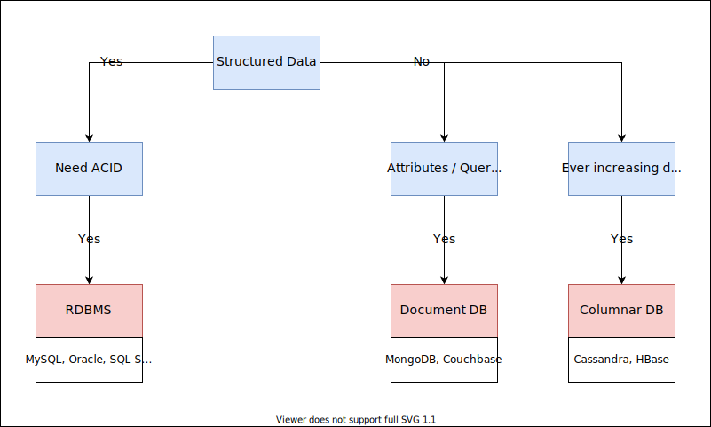
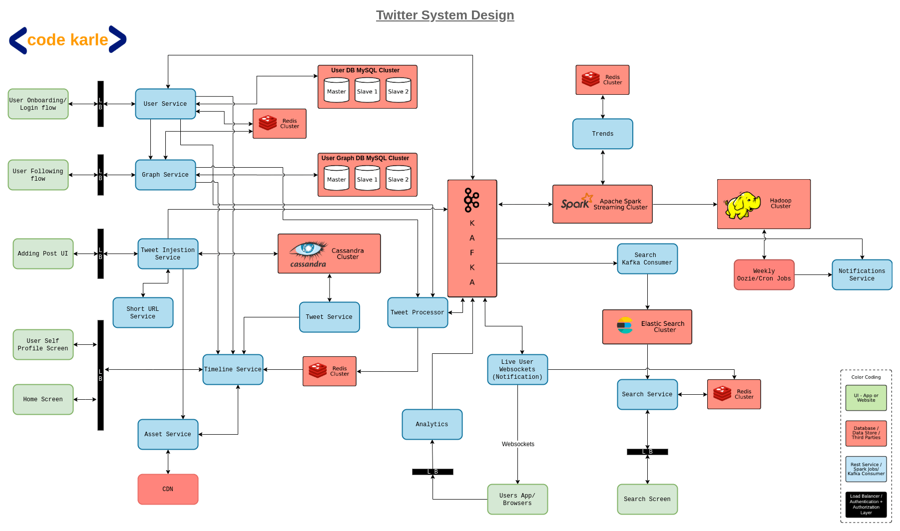

# codeKarle
## Database Design Tips ([video](https://www.youtube.com/watch?v=cODCpXtPHbQ))
Choice of database depends on three factors:
- Structure of data
- Query pattern
- Scale

### Cache
**Redis, Memcached, etcd, Hazelcast**
- Used when same data is queried many times, querying from the primary data source has a high latency.

### File/Blob Storage
**Amazon S3**
- Used storing images, videos, etc.
- Usually used together with a CDN.

### Text Search
**ElasticSearch, Solr (Both built on Apache Lucene)**
- Used for searching in text data like Amazon product information or Netflix movie/show information.
- Supports fuzzy search (search within a certain edit distance)
- These are not databases and there is no guarantee against data loss, so they should be used with some other primary source of data.

### Metrics
**InfluxDB, OpenTSDB**
- Time series database
- Optimised for:
  - Sequential, append only writes
  - Bulk read for a given time range
  - No random read/write

### Analytics
**Hadoop**
- Large amount of data
- Data warehouse

### Relational vs. Non-relational database

## Twitter system design ([video](https://www.youtube.com/watch?v=EkudBdvbDhs))

### Requirements

#### Functional requirements
1. Tweet  
   Can have text, image, video, links.
2. Re-tweet
3. Follow
4. Search  
   Search for tweets containing some text.

#### Non-functional requirements
1. Read-heavy  
   100 time more read traffic than write traffic.
2. Fast rendering  
   Timeline should render in <1s
3. Fast tweet  
   Posting a new tweet should happen fast.
4. Some lag is acceptable  
   Page loading and rendering should be fast, but it is okay if there is some lag between a new tweet being posted and it being visible to other users.
5. Scale
   - 150 million DAU
   - 350 million MAU
   - 1.5 billion accounts
   - 500 million tweets/day  
     5700 tweets/s (avg)  
     12000 tweets/s (peak)

#### Types of users
1. Famous  
   Users with large number of followers.
2. Active users  
   People who accessed twitter in last 2 days.
3. Live users  
   Subset of active users. Users who are currently online.
4. Passive users  
   Users who have not accessed users in last 2 days.
5. Inactive users  
   Deleted (soft-deleted) accounts. Essentially the same as non existent accounts.

### System Design

- **Green** components are user interaction points (website/app).
- **Black** components are load balancers. All requests from the user interaction points are sent through these components. They also act as a reverse proxy, and handle authentication for all requests.
- **Red** components are third party services.
- **Blue** components are services written to handle the business logic.

#### User onboarding
- User service
  - Provides REST API for user related information.
  - This powers external UI and other internal services.
  - GET and bulk GET API for users.
  - POST API for creating / updating users.
  - User data is stored in a MySQL database and cached in Redis.

#### Follow
- Graph service
  - Store information about user follows.
  - GET and bulk GET API for followers and followees.
  - POST API to add / remove new follow connection.
  - Data stored in MySQl and cached in Redis.

#### Posting a tweet
When a new tweet is posted, a request is sent to the **Tweet Ingestion Service**. The **Tweet Ingestion Service** stores tweet in Cassandra. Cassandra is used because it can handle the required scale. Alternatively, HBase can be used as well.

The tweet ingestion service also puts a message in Kafka for the new tweet.

If the tweet contains some multimedia content (image/video), this is handled by the **Asset Service**. If the tweet has a link, this needs to be shortened, since a tweet has a limited number of characters. This is handled automatically by the **Short URL Service** without any user intervention.

#### Timelines
The **Timeline Service** is responsible for generating and returning all timelines.

The **User Timeline** shows all tweets by a single user. This can be generated by fetching all tweets with the given user id from the **Tweet Service**. The **Timeline Service** can also cache the user timelines in Redis.

The **Home Timeline** shows tweets by all users that the user follows. This is expensive to generate on the fly, since a user could be following thousands of other users, and this would required fetching tweets from all of those users and merging them into a single list of tweets, sorted by time. So, the Home Timeline is pre-computed and cached in Redis.

When a Famous user posts a tweet, this would require updating the timelines of a large number of users at once. To avoid this, the Tweet Processor does not update the timelines of followers if the tweet is posted by a Famous user. Instead, the **Timeline Service** fetches tweets from all Famous users that a user follows and merges them with the user's cached timeline from Redis before returning the timeline. After merging the tweets, the **Timeline Service** updates back the timeline in Redis, and stores a timestamp for the last time when the Famous user tweets were merged. This timestamp is used the next time when the **Timeline Service** needs to merge the Famous user tweets.

Whenever a user posts a new tweet, the **Tweet Ingestion Service** sends a message to Kafka. The **Tweet Processor** then reads this message and updates the timelines of all followers of this user, in Redis. It uses the **Graph Service** to get the list of followers. The **Timeline Service** returns this cached timeline, when required, instead of generating it on the fly.

Since Redis stores data in memory, storing the timelines for all users requires a lot of RAM. To avoid this, only the timelines for active users in cached. The Tweet Processor can figure out if a user is active or passive by querying the **User Service**. When a passive user comes online, the **Timeline Service** needs to generate the timeline by querying the **Graph Service** and the **Tweet Service**. It then puts this timeline in Redis (since the user is now active) before returning it.

#### Live User Notification
For users that are currently online, a notification needs to be sent when a new tweet is added to their Home Timeline. When a new tweet is posted, once the Tweet Processor has figured out which users' timelines need to be updated, it writes back a message to Kafka for all users that are Live users. The **Live User Websocket** reads this message and sends a notification to the user.

#### Search
When the **Tweet Ingestion Service** writes a tweet to Kafka, the **Search Kafka Consumer** reads the tweet and adds it to the Elastic Search Cluster. Elastic Search is powered by Lucien, so any Lucien based service can be used. When the user does a search, a request is sent to the **Search Service**, which then returns the results from the Elastic Search Cluster. Before returning the results, it caches the results in Redis, because it is likely that the same search will be done by multiple users.

#### Analytics
The Apache Spark Streaming reads the tweets from Kafka, tokenizes the tweets into words and phrases, removes common words (like a, an, the), and keeps track of the most common tokens for some duration (like the past 1hr). It then periodically sends this data to the **Trends Service** which uses this data to generate the list of trending topics. It stores this data to Redis. Storing this in a database is not required since we don't need long term storage for this data.

For longer term analytics, the tweets are stored in a Hadoop cluster. For example, this can be used to generate a weekly newsletter to users. There can be a weekly cron job which reads data from the Hadoop cluster, and sends it to the **Notification Service**, which then generates a newsletter and sends it to the user.